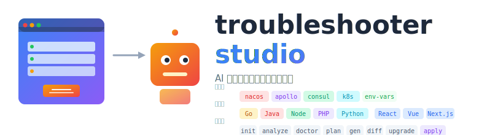
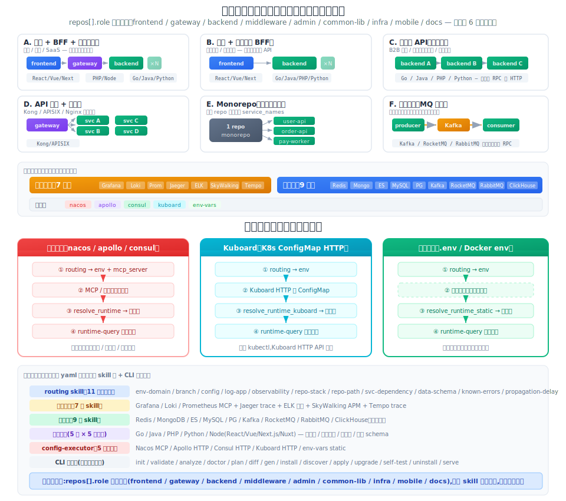

<p align="center">
  
</p>

# troubleshooter-studio

**AI 排障机器人工作台**：建模 / 生成 / 部署 / 管理一站式。

这是个两层的项目：

**上层（这个仓库）—— 排障机器人研制环境**
- 建模：`system.yaml` schema（系统 / 环境 / 仓库 / 配置源 / 可观测 / 数据层）+ init 向导 + 编辑器
- 分析：仓库 analyzer（5 技术栈 × 5 配置源）反推 service_names / config 映射
- 校验：validate / doctor（8 种漂移规则 + actionable `--fix`）/ plan
- 生成：generator（4 target × 模板渲染 + preserve 人工行 + diff）
- 管理：discover 扫本机装好的机器人、agent.Apply 原地改配置直接生效、导出/导入 yaml
- 三种入口：**CLI**（脚本 / CI 场景） / **桌面 app**（Wails v2，一站式管理） / **HTTP API**（`tshoot serve`）

**下层（gen 产出的机器人）—— 完整的 AI 排障能力**
- **Skills 库** 10+ 个：routing（按 env 路由到配置中心）/ config-executor（nacos/apollo/consul/k8s/env-vars 五后端）/ redis / mongodb / mysql / es / kafka runtime-query / tracing-query（Jaeger）/ elk-log-query / diagram-generator
- **运行时**：MCP 或 HTTP 脚本读远程配置中心 → 解析连接串 → 查数据层 / trace / 日志，按环境分支切换
- **话术库**：首次自我介绍动态列 skill / 7 类故障标准回复（MCP 连不上、K8s RBAC、凭证失效、key 缺失、写拒、Grafana 403、trace 找不到）/ 每 skill 自检示例
- **部署到 4 种 AI 平台**，每种自带 `install.sh`：

| 目标形态 | 产物核心 | 一键部署 |
|---|---|---|
| **OpenClaw 安装包** | `install.sh` + workspace 模板 + MCP 配置 + `self-test.sh` | `bash install.sh` 装到 OpenClaw |
| **Claude Code** | `CLAUDE.md` + `skills/` + `install.sh` | `bash install.sh <project-dir>` |
| **Cursor IDE** | `.cursorrules` + `.cursor/rules/*.mdc` + `skills/` + `install.sh` | `bash install.sh <project-dir>` |
| **Standalone Web 聊天** | `server.py` + `index.html` + `Dockerfile` + docker-compose + `install.sh` | `bash install.sh` 或 `docker compose up --build` |

在 `system.yaml` 的 `generation.targets` 里勾选需要的形态，一次 gen 全出。机器人本体脱离 studio 可独立运行。

## 30 秒试跑

**桌面 app（推荐）：**

```bash
git clone <此仓库> && cd troubleshooter-studio
make desktop-app                       # web 前端 + Wails 编译 + 打 .app 包
open dist/TroubleshooterStudio.app     # 弹出桌面窗口，不会再开 Terminal
```

打开后点左侧「已装机器人」扫本机；点「创建向导」7 步生成新 yaml。
首次启动可能被 Gatekeeper 拦（没签名）——右键 App → 打开 → 再确认一次，之后不拦。

**纯 CLI 试跑（不想要 GUI）：**

```bash
go build -o bin/tshoot ./cmd/tshoot    # 或 go install ./cmd/tshoot
./bin/tshoot demo                      # 零配置，内置 examples 走一遍 validate → plan → gen
```

模板和示例已 `go:embed` 进二进制，`bin/tshoot` 拷到任何位置都能跑 demo / gen，不依赖仓库 checkout。

## 适配的系统架构

<p align="center">
  
</p>

本工具适配 **多服务 × 多环境的微服务架构**。架构不固定，`repos[].role` 自由组合：

| 架构模式 | repos 组合 | 典型场景 |
|---|---|---|
| 前端 + BFF + 后端 | `frontend` + `gateway` + `backend` × N | 电商 / 社交 / SaaS |
| 前端 + 后端（无 BFF） | `frontend` + `backend` × N | 中小系统 / 内部工具 |
| 纯后端 API（无前端） | `backend` × N | B2B 接口 / 内部服务集群 |
| API 网关 + 微服务 | `gateway` + `backend` × N | Kong / APISIX 统一入口 |
| Monorepo（单仓多服务） | 1 repo + 多 `service_names` | 大厂 monorepo |
| 事件驱动（MQ 串联） | `backend` × N + Kafka / RocketMQ | 无同步调用，纯异步 |

基础设施按需启用：

- **可观测性** — Grafana / Prometheus / Loki / Jaeger / ELK / SkyWalking / Tempo（共 7 项）
- **数据层** — Redis / MongoDB / ES / MySQL / PostgreSQL / Kafka / RocketMQ / RabbitMQ / ClickHouse（共 9 项）
- **技术栈** — Go / Java / PHP / Python / Node（React / Vue / Next.js / Nuxt）

### 支持的配置源

| 配置源 | `config_center.type` | 排障链路 |
|---|---|---|
| Nacos / Apollo / Consul | `nacos` / `apollo` / `consul` | MCP 或 HTTP 脚本读配置 → 解析连接串 → 查数据层 |
| Kubernetes ConfigMap / Secret | `kubernetes` | kubectl get → 解析连接串 → 查数据层 |
| 纯环境变量 / .env 文件 | `env-vars` | 安装时直接填连接串 → 查数据层（跳过配置读取） |

### 不适用的场景

| 场景 | 原因 |
|---|---|
| Serverless / FaaS | 无长驻服务概念，排障模型不匹配 |
| 单体应用（非微服务） | 工具为多服务 × 多环境设计，单体用不上大部分能力 |

## 桌面 app 能用什么

入口：`make desktop-app && open dist/TroubleshooterStudio.app`。核心 5 件事：

| 动作 | 页面 | 做什么 |
|---|---|---|
| **1. 发现已装机器人** | 🤖 已装机器人 | 扫 `~/.openclaw/workspace/` + 你自选的项目根，列出本机所有部署的机器人（每张卡显示 target / 环境数 / 仓库数 / skill 数 / 最近更新时间） |
| **2. 编辑配置直接生效** | 🤖 已装机器人 → 编辑配置 | 展开内嵌 yaml 编辑器 → 预演（只看改动清单不写盘）或应用（重 gen + rsync 到活 workspace，保留 `preserve_on_regenerate` 里的用户手改） |
| **3. 一键重新生成** | 🤖 已装机器人 → 重新生成 | 不改 yaml，按原配置重跑 gen（模板或 tshoot 升级后用） |
| **4. 导出 yaml** | 🤖 已装机器人 → 导出 yaml | Wails 原生 SaveFileDialog 选路径存盘 |
| **5. 新建机器人** | 🧙 创建向导 | 7 步表单生成 `system.yaml`（草稿存 localStorage，切页刷新不丢）；生成完可直接 gen |

机器人靠产物根目录的 `tshoot.json` 锚点识别（gen 时自动写入，含完整 `system_yaml` 原文）。macOS 下通过 Spotlight 全盘扫 `tshoot.json`，embedded / claude-code / cursor 散落在任意目录的机器人都能零配置找到。

Gen 只产生产物目录；**真正装到 OpenClaw / Claude Code 等平台仍需走产物里的 `install.sh`**（首次收凭证）。把 install.sh 的交互搬进桌面 app 是下一个迭代项。

其余可视化页面（Init / Editor / Analyze / Plan / Gen / Doctor / Diff）沿用原有 Vue 前端，底层通过 Wails binding（`window.go.main.App.*`）直接调 Go，不走 HTTP。

## CLI 用法（脚本化 / CI 集成）

```bash
go build -o bin/tshoot ./cmd/tshoot
# 或在仓库根 `go install ./cmd/tshoot` 装到 $GOBIN/tshoot

# 1. 交互向导生成 system.yaml（支持 -i 从已有 yaml 预填；Ctrl+C 会把草稿保存到 ~/.tshoot/init-draft.yaml）
./bin/tshoot init -o system.yaml                   # 从零开始
./bin/tshoot init -i existing.yaml -o new.yaml     # 改动哪里就回答哪里，其余回车接受

# 2. 校验
./bin/tshoot validate -i system.yaml

# 3. 分析仓库（可选 --auto-clone 自动浅克隆缺失仓库）
./bin/tshoot analyze -i system.yaml \
  --repos-root ./repos --auto-clone -o analysis.json

# 4. 预览将生成什么（不落盘）
./bin/tshoot plan -i system.yaml --analysis analysis.json

# 5. 生成机器人产物
./bin/tshoot gen -i system.yaml --analysis analysis.json

# 6. 部署到 OpenClaw
cd dist/<system-id> && bash scripts/install.sh && bash scripts/self-test.sh
# install.sh 首次运行会交互收集凭证，保存到 scripts/.env（0600）；第二次重跑自动复用、不再问。
# 想改某个凭证：编辑 scripts/.env 后重跑；想重新问：rm scripts/.env && bash install.sh。
```

每个命令成功后 CLI 会打印「下一步：xxx」提示，不再让你猜下一条命令是什么。
`tshoot`（无参）打印欢迎页；`tshoot --version` 打印版本（可用 `-ldflags "-X main.version=..."` 注入）。

### 多目标输出

`system.yaml` 的 `generation.targets` 支持同时生成多种格式：

```yaml
generation:
  targets:
    - openclaw       # OpenClaw 安装包（install.sh + workspace）
    - claude-code    # Claude Code（CLAUDE.md + skills/）
    - cursor         # Cursor IDE（.cursorrules + .cursor/rules/*.mdc）
    - embedded       # Studio 桌面端内嵌对话（system-prompt.md + skills/）;"standalone" 是历史别名
```

一次生成四种格式：

```bash
./bin/tshoot gen -i system.yaml
# → dist/<id>/             OpenClaw 安装包
# → dist/<id>-claude-code/ Claude Code
# → dist/<id>-cursor/      Cursor IDE
# → dist/<id>-embedded/    Studio 桌面端内嵌对话
```

| 目标 | 核心产物 | 一键部署 |
|---|---|---|
| `openclaw` | install.sh + self-test.sh + workspace 模板 | `bash install.sh` → 部署到 OpenClaw |
| `claude-code` | CLAUDE.md + skills/ + **install.sh** | `bash install.sh <project-dir>`（自动备份已存在的 CLAUDE.md） |
| `cursor` | .cursorrules + .cursor/rules/*.mdc + skills/ + **install.sh** | `bash install.sh <project-dir>`（自动备份已存在的 .cursorrules） |
| `embedded` | system-prompt.md + skills/ + scripts/ + tshoot.json | Studio 桌面端扫到即用,"💬 打开对话"直连 LLM |

embedded 模式走桌面端 Studio 原生 chat 协议（OpenAI 兼容 API），支持 Anthropic / OpenAI / DeepSeek / Qwen / MiniMax / Moonshot / 智谱 / Ollama 8 家 provider（按 `agent.model` 前缀路由）。不再维护独立部署路径（老名 `standalone` 在 `config.LoadFromBytes` 被自动归一成 `embedded`）。

所有 CLI 命令都支持 `--format=json`，便于 CI/CD 管道消费。

每份产物目录都自带 `README.md`（能力清单 / 部署前凭证 / 常见问题 / 升级卸载），部署前 `cat README.md` 就有路标。

### Embedded 内嵌对话（桌面端 Studio 原生;老名 standalone）

`embedded` target（历史名 `standalone`）不再独立部署 —— 产物只是 Studio 内嵌对话用的素材
（`system-prompt.md` + `skills/` + `scripts/` + `tshoot.json`）。桌面 app 打开"已装机器人"页
点 **💬 打开对话** 即可跟机器人聊，细节：

- **多 provider 直连** — Go 端 `internal/llmchat`（走 OpenAI 兼容协议 + `base_url` 切换），
  按 `agent.model` 前缀路由到 Anthropic / OpenAI / DeepSeek / Qwen / MiniMax / Moonshot / 智谱 / Ollama
- **流式输出** — Wails `EventsEmit` 逐 token 推到前端，自带停止按钮（cancel SDK ctx 断 http）
- **Markdown 渲染** — 前端 `marked` 库，代码块高亮 + 禁 raw html 防 prompt injection
- **对话历史持久化** — `localStorage` 按 bot path 分 key；切机器人 / 重启 app 不丢
- **默认环境下拉** — 从 yaml 的 environments 动态渲染；选定后拼到 system prompt（白名单防注入），机器人不用每次反问"哪个环境"
- **API key 本会话缓存** — `window` 级内存，app 关了就清，不落盘

### 机器人回答质量的通用增强（4 target 共享）

- **首次打招呼自我介绍** — 用户说 hi / 你好 / ping / 问"你能干什么"时，机器人按 AGENTS.md 里的模板**动态列出自己的 skill 清单**（从 `skills_whitelist` + `infrastructure` 派生）+ 3 条可直接粘贴的示例问题
- **错误应对话术** — AGENTS.md 针对 MCP 连不上 / K8s RBAC / 凭证失效 / 配置 key 缺失 / 写操作被拒 / Grafana 403 / trace 找不到 等 7 类常见错误定义了标准话术（发生了什么 / 可能原因按概率 / 用户下一步做什么）
- **脚本 actionable 错误** — `config-executor/scripts/*.py`（resolve_runtime_static / _k8s / apollo / consul / nacos）顶层 try/except，stdout 输出结构化 JSON `{"error":..., "hint":"改 scripts/.env 的 X / 重跑 install.sh / ..."}`，机器人直接复述 hint 给用户，不糊 Python 堆栈
- **每个 skill 自检示例** — 每份 `SKILL.md` 末尾带「自检示例」段（5 个核心 skill 手写具体 case，其余 11 个通用模板），既给 LLM 参考也给维护者当 smoke test

## 子命令一览

| 命令 | 功能 | 常用场景 |
|---|---|---|
| `init` | 交互式向导生成 `system.yaml` | 新系统首次接入 |
| `validate` | 校验 `system.yaml` 语法与字段完整性 | 写完 yaml 后 |
| `analyze` | 扫描代码仓库，抽取 service_names 与配置中心线索 | 生成前补齐映射 |
| `doctor` | 对比声明 vs 代码实态，报告漂移 | 定期体检 |
| `plan` | 干跑 gen，展示 skills / files / overrides / config-map 分布 | gen 前预览 |
| `watch` | 文件变化时自动重跑 plan | 开发时持续反馈 |
| `gen` | 生成机器人产物（自带 preserve 保护人工行 + 写 `tshoot.json` 锚点） | 正式落盘 |
| `diff` | 精确到文件 + 行级的新旧产物对比 | review 变更 |
| `upgrade` | 备份 + 重 gen + diff 一把过 | tshoot 版本升级后 |
| `serve` | 启动 Web UI（HTTP API + 前端界面） | 脚本化访问 / 无桌面环境 |
| `demo` | 零配置试跑：用内置 examples 走一遍 validate → plan → gen | 第一次体验 tshoot |
| `skill new` | 在模板库里脚手架新 skill | 扩展 agent 能力 |

以下能力**暂时只在桌面 app 里**有（CLI 还没包装对应子命令）：
- **扫描已装机器人**（`internal/discover.Scan`）— 找本机部署的所有机器人
- **编辑并应用**（`internal/agent.Apply`）— 用新 yaml 原地更新活 workspace，带 preserve

## 配置源支持

| 类型 | analyzer 抽取 | 运行时后端 | config-map 字段 |
|---|---|---|---|
| `nacos` | YAML + properties + .env | MCP（`nacos-mcp-router`） | `namespaceId` / `group` / `dataId` / `mcp_server` |
| `apollo` | YAML + properties + .env | HTTP 脚本（`apollo_config.py`） | `appId` / `cluster` / `namespaces` / `meta` / `mcp_server` |
| `consul` | YAML + properties + .env | HTTP 脚本（`consul_config.py`） | `kv_prefix` / `default_context` / `host` / `mcp_server` |
| `env-vars` | .env | 安装时直接填连接串（`resolve_runtime_static.py`） | — |
| `kubernetes` | .env + YAML | kubectl（`resolve_runtime_k8s.py`） | — |

Nacos 生态有成熟 MCP 包，直接注册到 OpenClaw；Apollo / Consul 生态暂无可信 MCP，改用 Python 脚本通过官方 HTTP API 直连（零外部依赖，仅标准库）。

## 可观测性支持（7 项）

| 工具 | skill 名 | 查询方式 | 排障用途 |
|---|---|---|---|
| Grafana | 内置 MCP（per env） | 仪表盘面板查询 | 指标巡检 / 错误率趋势 |
| Prometheus | via Grafana MCP | PromQL | 实时指标 / 告警阈值验证 |
| Loki | via Grafana MCP | LogQL | 日志搜索（方案 A） |
| ELK | `elk-log-query` | ES `_search` API + Kibana | 日志搜索（方案 B，可与 Loki 共存） |
| Jaeger | `tracing-query` | Jaeger HTTP API | 链路追踪：trace ID → span 树 |
| SkyWalking | `skywalking-query` | GraphQL API | APM：服务拓扑 + trace + 慢端点 |
| Tempo | `tempo-query` | Tempo HTTP API / Grafana proxy | 链路追踪（Grafana 生态替代 Jaeger） |

## 数据层支持（9 项）

| 组件 | skill 名 | 查询方式 | 排障用途 |
|---|---|---|---|
| Redis | `redis-runtime-query` | mcporter MCP（只读） | 缓存 key / TTL / 值 |
| MongoDB | `mongodb-runtime-query` | mcporter MCP（只读） | query / aggregate / count |
| Elasticsearch | `es-runtime-query` | mcporter MCP（只读） | 索引 / DSL / 命中 |
| MySQL | `mysql-runtime-query` | mcporter MCP（只读 SELECT） | 数据一致性 / 慢查询 |
| PostgreSQL | `postgresql-runtime-query` | mcporter / psql CLI（只读） | pg_stat / 连接数 / 表大小 |
| Kafka | `kafka-runtime-query` | kafka CLI | topic / 消费积压 / 死信 |
| RocketMQ | `rocketmq-runtime-query` | mqadmin CLI | topic / consumer / 积压 / DLQ |
| RabbitMQ | `rabbitmq-runtime-query` | HTTP Management API | queue / exchange / 消息数 |
| ClickHouse | `clickhouse-runtime-query` | clickhouse-client / HTTP API（readonly=1） | OLAP 查询 / 分区 / 慢查询日志 |

> 所有数据层 skill 严格只读。用户按需在 `skills_whitelist` 中选择，未列入的不会生成。

## 多环境 MCP

每个 env 注册独立的 MCP 实例（如 `nacos-mcp-server-dev`、`nacos-mcp-server-prod`），agent 通过 `config-map.yaml` 的 `mcp_server` 字段选择正确实例，不需要人工切换。

`per_env_credentials: true` 可进一步让每个 env 使用独立用户名 / 密码 / token（默认 `false` = 共用凭证）。

## 技术栈分析器（5 栈）

| 栈 | 识别来源 | 框架检测 | 配置扫描 |
|---|---|---|---|
| `go` | `go.mod` | — | YAML |
| `java` | `pom.xml` | Spring profile | YAML + properties |
| `node` | `package.json` | Next.js / Nuxt / Vite / CRA / Vue CLI / Angular | `.env.*`（提取 API URL） |
| `php` | `composer.json` | — | `.env.*` + YAML |
| `python` | `pyproject.toml` / `setup.py` | Django / FastAPI / Flask / Tornado / Sanic | `.env.*` + YAML |

`analyze --auto-clone` 会自动浅克隆缺失仓库（需 git + 凭证），`--branch` 可指定分支。

## Doctor 漂移检测（8 种规则）

| 规则 | 级别 | 说明 |
|---|---|---|
| `missing-repo` | error | repos-root 下找不到仓库 |
| `origin-mismatch` | warning | 仓库 git origin 与声明 URL 不符（跨 ssh / https 智能归一化） |
| `stack-mismatch` | warning | go.mod / pom.xml 暗示的 stack 与声明不一致 |
| `service-drift` | warning / info | 声明的 service 未在代码中检测到，或代码中多出未声明 service |
| `config-center-drift` | warning | 代码里的配置中心类型与声明不符 |
| `config-center-unused` | warning | 声明了但所有仓库都没用到 |
| `data-store-unused` | info | 启用了但关键字未出现在 findings |
| `undeclared-env-profile` | info | 代码里的 profile 名未在 environments 中声明 |

每条 issue 都带 `↳ 建议:` 可执行修复动作（改哪一行 / 跑哪条命令）；`tshoot doctor` 末尾按 error / warning / info 分级给"下一步"。

对机器可处理的 issue（`stack-mismatch` / `config-center-unused` 等），可以走 `--fix` 让 tshoot 自动改 yaml：

```bash
tshoot doctor -i system.yaml --repos-root ./repos --fix        # 显示 patch 列表 + 询问确认
tshoot doctor -i system.yaml --repos-root ./repos --fix -y     # 跳过确认直接写回（CI 模式）
```

`--fix` 走**行级精确替换**：仅改目标行，其他行 bit-perfect 保留（空行 / 注释 / 缩进都不动），写回前自动备份到 `system.yaml.bak.<ts>`。

## Preserve / Diff / Upgrade 生命周期

- 手改 `config-map.yaml` 的 inferred 行为 verified（不带 `source:` 字段），下次 `gen` 自动保留
- `generation.preserve_on_regenerate` 列表中的文件（如 `SOUL.md`）re-gen 时整体保留
- 优先级：analyzer finding > prior manual override > inferred skeleton
- 切换 config_center 类型会自动丢弃旧 overrides，避免字段错配
- `tshoot diff` 模拟"带 preserve 的 gen"，精确展示真实会发生的变化
- `tshoot upgrade` = 自动备份到 `<out>.bak.<ts>` + gen + diff 一步到位

## Skill 脚手架

```bash
tshoot skill new payment-check --description "支付链路排障" --with-scripts
# → templates/workspace/skills/payment-check/
#     SKILL.md.tmpl   （含 TODO 骨架：执行流程 / 输入 / 输出 / 硬约束）
#     scripts/README.md

# 加入 system.yaml 白名单后即可生效
tshoot plan -i system.yaml   # 确认新 skill 出现在 "Skills included"
tshoot gen -i system.yaml
```

## 构建与发布

仓库根 `Makefile` 把构建流程收敛成几条命令：

```bash
# CLI 流水线
make              # == make build：go build 到 bin/tshoot
make web          # npm run build → 拷到 internal/webui/dist/（embed 目标）
make release      # web + 多平台交叉编译（darwin/linux × amd64/arm64）到 dist/bin/
make demo         # build 后立即 ./bin/tshoot demo

# 桌面 app 流水线（Wails v2）
make desktop      # make web + Go 带 `desktop production` tags + 链 UniformTypeIdentifiers.framework
                  # → bin/tshoot-desktop（裸二进制，Finder 双击会弹 Terminal）
make desktop-app  # 上一步 + scripts/package-macos.sh 打 .app bundle + 多尺寸 .icns
                  # → dist/TroubleshooterStudio.app（GUI 双击不弹 Terminal）
make desktop-dev  # desktop + `dev` tag（留给 Vite 热重载 / devtools，后续整合）

# 通用
make test         # go test -race -cover ./...
make lint         # go vet + gofmt -l + vue-tsc --noEmit
make clean        # 清 bin/ dist/bin/ 和 embed 的 dist 目标
```

版本号自动注入：`git describe --tags --abbrev=0` + `git rev-parse --short HEAD` → `tshoot --version` 打印 `tshoot v0.2.0 (abcdef)`，桌面 app 用同样版本号写入 `tshoot.json.tshoot_version` + macOS bundle 的 `CFBundleVersion`。

`templates/` 和 `examples/` 通过仓库根的 `embed.go` 用 `//go:embed` 打进二进制（CLI 和桌面 app 共用）—— 这样 `go install` 出来的 tshoot 在任何目录都能跑 demo / gen，无需 clone 仓库。运行时优先用磁盘上的 `templates/` / `examples/`（存在则用），否则从 embed 解压到 `os.TempDir()` 复用。

### Wails 构建的几个坑

- **必须带 build tags**：`-tags "desktop production"`，不然 `wails.Run` 主动拒跑，报 "Wails applications will not build without the correct build tags."
- **必须 cgo + 链 UniformTypeIdentifiers**：`CGO_ENABLED=1 CGO_LDFLAGS="-framework UniformTypeIdentifiers -mmacosx-version-min=10.13"`，不然链接报 `_OBJC_CLASS_$_UTType` 找不到。`wails build` CLI 自动注入，`go build` 直接调要自己带。
- **不打 .app 包直接双击**：macOS 会把裸二进制拖到 Terminal 里启动（弹终端窗口）。走 `make desktop-app` 产出的 `dist/TroubleshooterStudio.app` 就不会。

## 测试与 CI

本地预演（与 CI 一致）：

```bash
make lint                      # go vet + gofmt -l + vue-tsc
make test                      # 全量 + 竞态（~4s）
```

CI 流水线 `.github/workflows/ci.yml` 在每次 push / PR 上自动运行。

覆盖率（最新）：analyzer 82% / config 85% / doctor 79% / generator 78% / gitclone 93% / initwizard 87% / skillscaffold 79% / upgrade 76% / watcher 74%。
最关键的 yaml-patching 路径（`doctor.Fixer`）有行级 bit-perfect 保留测试：写回后只有目标行变，其他所有行 / 注释 / 空行不动。

## 目录结构

```
embed.go                    # 根 package（package tshoot），templates/ + examples/ 走 go:embed
Makefile                    # build / web / release / desktop / desktop-app / test / lint / ...
cmd/
  tshoot/                   # CLI 入口（12 个子命令：init / validate / analyze / doctor /
                            #   plan / watch / gen / diff / upgrade / serve / demo / skill）
  tshoot-desktop/           # Wails v2 桌面 app 入口；复用 api/ + internal/ 所有逻辑
                            # 暴露的 App.* bindings: Version / DiscoverBots / Validate / Gen
                            #   / ApplyBot / SaveYAML
api/                        # REST API（给 tshoot serve 用）；handler 复用 internal 包
web/                        # 前端（Vue 3 + Vite + TS）；8 + 1（BotsPage）个页面
  src/lib/bridge.ts         # 桥接层：桌面 app 走 Wails binding，浏览器回退 fetch
  src/types/wails.d.ts      # Wails binding TypeScript 类型声明
  wailsjs/runtime/          # Wails v2 运行时（window.go 注入脚本）
internal/
  config/                   # system.yaml 加载与校验（Load / LoadFromBytes）
  analyzer/                 # 仓库扫描：Go / Java / Node / PHP / Python × 5 种配置源
  generator/                # 模板渲染 + preserve + diff + plan（多 target 共享 staging）
                            # 末尾写 tshoot.json 锚点（discover / apply 依赖这个）
  discover/                 # 扫 tshoot.json 识别本机已装机器人（DiscoveredAgent + Scan）
  agent/                    # 读-改-部署闭环：agent.Apply(new yaml) 原地 render + rsync
  doctor/                   # 声明 vs 实态漂移检测 + actionable --fix（yaml 行级 bit-perfect 替换）
  upgrade/                  # 备份 + 重 gen + diff
  gitclone/                 # git clone + ReadOrigin + CanonicalURL
  initwizard/               # 交互向导 → system.yaml
  skillscaffold/            # skill new 脚手架
  watcher/                  # 文件变化轮询（零外部依赖）
  webui/                    # 前端 dist 的 go:embed 入口（serve 和桌面 app 共用）
scripts/
  package-macos.sh          # make desktop-app 的打包脚本（sips + iconutil → .icns，写 Info.plist）
templates/                  # .tmpl 模板；按 target 分组：
                            #   workspace/  scripts/  claude-code/  cursor/  embedded/
examples/                   # system.yaml 示例 × 11 覆盖不同配置源和架构模式:
                            #   shop-* (nacos + BFF+后端) / three-tier (前后端+gateway) /
                            #   apollo / consul / env-vars / k8s (配置源差异)
                            #   monorepo (单仓多服务) / event-driven (MQ 串联) /
                            #   b2b-api (纯后端集群,无前端)
                            # + fake-repos-* × 5 配套的假仓库用于端到端测试
schema/system.schema.yaml   # 带完整注释的 schema 参考
assets/                     # logo.svg + architecture.svg
.github/workflows/ci.yml    # CI 门禁
```

## 已知限制

- 桌面 app 目前**不包装 install.sh 的首次凭证收集**——gen 完仍需 `cd <output> && bash install.sh` 走交互填凭证；把它挪进 GUI 表单是下一个迭代项
- 桌面 app 没代码签名 / 公证，macOS Gatekeeper 首次会拦（右键 → 打开确认一次即可）
- Apollo / Consul 走 HTTP 脚本而非 MCP（生态尚无稳定 MCP 包；Nacos 走 MCP）
- Node 生态不扫配置中心（极少用 Nacos / Apollo / Consul）
- 不自动推断服务调用拓扑（只做 per-repo 机械抽取）
- `tshoot init` 暂不生成 `per_env_credentials`、`dataid_patterns` 等高级字段（高级用户手工补）
