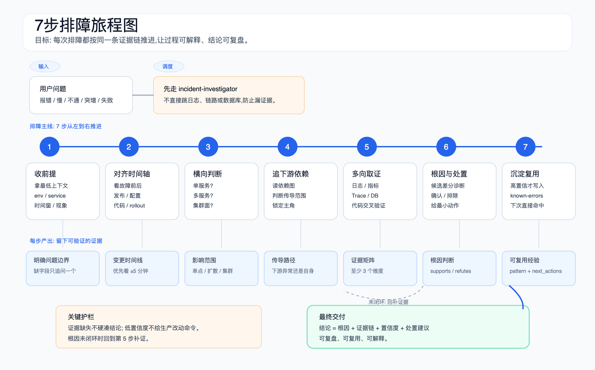

<p align="center">
  
</p>

# troubleshooter-studio

AI 排障机器人工作台。用 `troubleshooter.yaml` 描述一个微服务系统，生成可安装到 OpenClaw、Claude Code、Cursor、Codex CLI 的排障机器人。

## 项目模型

| 层级 | 说明 |
|---|---|
| 本仓库 | 研制环境：CLI、桌面 app、HTTP server 三入口共享 `internal/`，负责建模、扫描、校验、生成、部署 |
| 产出物 | 独立运行的排障机器人：skills、MCP、路由表、故障话术，安装后脱离 studio 使用 |

## 故障闭环工作台

桌面工作台用一个持久化 Case 串联故障闭环。代码修复走验证、方案评估、修复、合并、人工部署、回归六个阶段；数据、配置、基础设施、网络、外部依赖和瞬时问题走验证、方案评估、人工处置、回归四个阶段。阶段状态、证据、授权、代码提交、部署观察和回归结果写入本地 SQLite；Studio 重启后从同一 Case 继续，不再根据 Agent 最终文本猜测进度。

代码修复路径有两个彼此独立的用户授权点：根因和证据达到修复门槛后，用户先批准启动修复；修复分支完成并推送后，用户再批准把指定 commit 合并并推送到环境分支。授权绑定 Case 版本、仓库、commit、目标分支和目标分支 HEAD，任一范围变化都要重新确认。非代码路径不创建 Git 授权：操作人完成外部处置后，显式确认实际执行摘要和证据，Studio 再启动回归。

Studio 不执行应用部署。环境分支推送后，Case 保持在“等待部署”，由人工部署并点击“已部署，开始验证”或发送明确的“已部署”通知。通知只启动只读版本采集：`http` 或 `k8s` 能明确证明运行版本与目标 merge commit 不一致时阻断回归；未配置采集方式、端点暂不可读或无法唯一识别版本时，记录 `unavailable` 诊断并继续用本轮新鲜业务证据回归。运行版本是增强证据，不是要求用户手工补充的门槛。

HTTP verifier 默认拒绝 loopback、内网、link-local 和云 metadata 地址，并在每次连接时重新校验 DNS 结果；确需访问该环境专用内网版本接口时，在对应环境的 `deployment_verification.http` 显式设置 `allow_private: true`。该开关只放行配置 URL 的精确 host，云 metadata 仍永久禁止，也不会使用系统 HTTP 代理。

回归复用首次验证使用的验证 Agent，但使用独立的 `regression` attempt 和本轮新证据。验证通过后 Case 进入 `fixed_verified`；仍复现时保留本轮部署版本和证据，cycle 加一后回到排障阶段。旧 `runs.json` 只导入为只读 `legacy_archived` Case，用户明确“从新一轮验证继续”时才创建新的活动 Case。

完整的页面入口、状态、Agent 分工、授权和恢复规则见[故障闭环与 Agent 工作流](docs/incident-workflow.md)；排障 Agent 内部的七步取证法见[排障链路](docs/troubleshooting-flow.md)。

## 从哪里开始

| 目标 | 入口 |
|---|---|
| 第一次跑通 | [下载与安装](#下载与安装) → [入口](#入口) → [部署目标](#部署目标) |
| 看机器人能力 | [机器人能力](#机器人能力) → [排障链路](docs/troubleshooting-flow.md) |
| 看故障闭环实现 | [故障闭环与 Agent 工作流](docs/incident-workflow.md) |
| 建模新系统 | [适配范围](#适配范围) → [Monorepo / Umbrella](#monorepo--umbrella) → [示例](examples/shop-troubleshooter.yaml) |
| 维护代码 | [贡献指南](CONTRIBUTING.md) → [决策记录](docs/decisions.md) |
| 配 CI / 发版 | [CI / Release](docs/CI-RELEASE.md) |

## 入口

| 入口 | 用途 |
|---|---|
| 桌面 app | 推荐给个人使用；覆盖建模、扫描、部署、已装管理、工作目录浏览 |
| CLI `tshoot` | 推荐给脚本、SSH、CI；覆盖 yaml 计算和 4 平台安装 |
| HTTP server `tshoot serve` | 推荐给浏览器调试和轻量 Web UI；提供校验、计划、生成、doctor、schema API；代码扫描/安装等本机原生能力仍用桌面 app 或 CLI |

## 部署目标

`generation.targets` 决定安装到哪些平台。

| 平台 | 部署位置 | 使用方式 | MCP 配置 |
|---|---|---|---|
| OpenClaw | `~/.openclaw/workspace/<name>/` | 客户端 agent 列表选择，安装后需重启客户端 | `~/.openclaw/openclaw.json` |
| Claude Code | `~/.claude/agents/<name>.md` + `~/.claude/skills/<name>/` | 项目内 `@<name>` 调 subagent | `~/.claude.json` |
| Cursor | `~/.cursor/agents/<name>.md` + `~/.cursor/skills/<name>/` | AI 侧栏选 Custom Agent，MCP 需在 Settings 启用 | `~/.cursor/mcp.json` |
| Codex CLI | `~/.codex/agents/<name>.toml` + `~/.codex/skills/<name>/` | 在 `codex` 中用自然语言派生 subagent | agent toml 内联 `[mcp_servers.*]` |

凭据位置：

- OpenClaw：`~/.openclaw/<id>-creds.json`
- Claude Code / Cursor / Codex：`~/.tshoot/<id>-creds.json`

Codex 需要网络访问时，安装流程会自动 patch `~/.codex/config.toml` 的 `[sandbox_workspace_write].network_access` 并备份原文件。

Claude Code、Cursor 和 Codex 的机器人安装在用户级目录，因此同一 IDE 可以同时看到多个系统的 Agent。Studio 会额外安装一份共享的 `tshoot-router` skill：它先用当前本地仓库路径和规范化 Git remote 唯一确定 `system_id`，再调用该系统精确的排障、验证或修复 Agent。找不到归属或多个系统同分时会停止并要求明确选择，不会按“报错/失败/慢”等通用关键词猜一台机器人。Studio 故障闭环本身已经持久化选定机器人，继续以 Case 的显式 `system_id/agent_id` 为准。

## 下载与安装

### 可选代码图谱（CodeGraph）

需要在故障期获得符号、调用链和影响面证据时，可显式开启：

```yaml
code_intelligence:
  enabled: true
  provider: codegraph
```

CodeGraph 首次安装约占 200 MB+，每个仓库在本地生成 `.codegraph/` 索引；索引不上传，遥测已关闭。安装使用固定 v1.3.1 及逐平台 SHA256 校验，并注册一个共享 MCP，通过显式 `projectPath` 查询；不会自动 checkout 或创建 worktree。分支不一致时图谱证据置信度低，机器人会回落 `rg`/`read` 路径。卸载默认保留索引，便于重新启用；需要释放空间时可手动删除 `.codegraph/`。

### 跨仓库服务拓扑

配置了至少两个有本地路径的可运行服务仓库后，部署或重新生成机器人时会扫描 HTTP/HTTPS、Feign 和 gRPC 端点，按“调用端点 → 接收端点”建立跨仓库候选关系。桌面工作台会展示端点位置、匹配理由和冲突，供用户确认、拒绝、改目标或手工补边；人工决定写回 `troubleshooter.yaml` 的 `service_topology.overrides`，它是需要评审和版本管理的真源，自动扫描结果则可随代码重建。

状态含义：

- `automatic`：证据超过确定性门槛，进入正式服务图。
- `confirmed` / `manual`：人工确认或补录，优先于自动结果，进入正式服务图。
- `candidate`：证据不足，只在工作台和证据文件展示，不参与自动导航。
- `rejected` / `stale`：已拒绝，或人工决定找不到当前端点证据，需要复查，不参与正式服务图。

生成物中的 `service-topology-query` 最多沿正式服务图向下游走三跳，并返回每条边的源码位置和确定性理由；运行时 trace 能确定真实链路时仍以 trace 为准。定位到具体仓库和入口端点后，如果启用了 CodeGraph，机器人再把 `projectPath` 和端点位置交给 CodeGraph 做仓库内符号、调用链和影响面分析；CodeGraph 不负责猜跨仓库边，索引不可用时继续回落 `routing`、`rg` 和文件读取。

示例：

```yaml
service_topology:
  overrides:
    - action: confirm
      from_service: mall-bff
      to_service: mall-order
      protocol: http
      method: POST
      path: /internal/orders
```

Release 同步发布到 GitHub 和 GitLab，任选一个源。

### 桌面 app，macOS 推荐安装

```bash
# GitLab 源，最新版
curl -fsSL https://gitlab.quguazhan.com/xiaolong/troubleshooter-studio/-/raw/main/scripts/install.sh | bash

# 私有 GitLab 项目
export GITLAB_TOKEN=glpat-xxx
curl -fsSL -H "PRIVATE-TOKEN: $GITLAB_TOKEN" \
  https://gitlab.quguazhan.com/xiaolong/troubleshooter-studio/-/raw/main/scripts/install.sh | bash

# GitHub 源
curl -fsSL https://raw.githubusercontent.com/452562082/troubleshooter-studio/main/scripts/install.sh | SOURCE=github bash

# 指定版本（把 vX.Y.Z 替换为 Release 页中的实际版本）
curl -fsSL https://gitlab.quguazhan.com/xiaolong/troubleshooter-studio/-/raw/main/scripts/install.sh | VERSION=vX.Y.Z bash
curl -fsSL https://raw.githubusercontent.com/452562082/troubleshooter-studio/main/scripts/install.sh | SOURCE=github VERSION=vX.Y.Z bash
```

脚本会下载 dmg、安装到 `/Applications/`、清理 quarantine 并启动应用。Release 页：

- [GitHub Releases](https://github.com/452562082/troubleshooter-studio/releases)
- [GitLab Releases](https://gitlab.quguazhan.com/xiaolong/troubleshooter-studio/-/releases)

如果公开 GitLab 源仍提示拿不到 release 列表，先检查本机是否残留无效 token：

```bash
env | grep GITLAB_TOKEN
unset GITLAB_TOKEN    # 公开项目可直接匿名访问
```

### 桌面 app，手动安装 dmg

1. 下载 `TroubleshooterStudio-vX.Y.Z.dmg.zip`
2. 用 macOS 自带 Archive Utility 解压
3. 打开 `.dmg`，把 `.app` 拖到 `Applications`
4. 首次打开若提示“已损坏”，运行 dmg 内的解锁脚本，或执行：

```bash
xattr -d com.apple.quarantine /Applications/TroubleshooterStudio.app
```

正式 dmg 已内置经过启动探测的固定 Chromium runtime；首次打开只导入本地基础工具，不需要另外联网下载浏览器。

### CLI

下载 `tshoot-vX.Y.Z-<os>-<arch>`，Windows 版本自带 `.exe`。

```bash
# macOS / Linux
chmod +x tshoot-vX.Y.Z-darwin-arm64
sudo mv tshoot-vX.Y.Z-darwin-arm64 /usr/local/bin/tshoot
tshoot --help
```

```powershell
# Windows PowerShell
Move-Item tshoot-vX.Y.Z-windows-amd64.exe C:\Users\<you>\bin\tshoot.exe
tshoot --help
```

## 从源码构建

```bash
git clone <repo> && cd troubleshooter-studio
```

桌面 app：

```bash
xcode-select --install
brew install go node
make desktop-app
open dist/TroubleshooterStudio.app
```

`make desktop-app` 首次构建会联网下载并真实探测固定 Chromium，之后复用 `.cache/desktop-browser-runtime`；仅构建不含浏览器资源的开发裸二进制可使用 `make desktop`。

CLI：

```bash
make
./bin/tshoot demo
./bin/tshoot init -o troubleshooter.yaml
./bin/tshoot gen -i troubleshooter.yaml -o ./out
./bin/tshoot install --path ./out --target openclaw
```

Linux / Windows 当前只支持 CLI。`make wails-gen`、`make icon` 是贡献者任务。

## 适配范围

<p align="center">
  
</p>

| 类型 | 支持 |
|---|---|
| 服务角色 | frontend、gateway、backend、middleware、admin、mobile、common-lib、infra、docs |
| 可观测性 | Grafana、Prometheus、Loki、Jaeger、Tempo、ELK、SkyWalking、Kuboard/K8s |
| 数据层 | Redis、MongoDB、Elasticsearch、MySQL、Doris、PostgreSQL、Kafka、RabbitMQ、ClickHouse |
| 配置源 | Nacos、Apollo、Consul、Kuboard(K8s ConfigMap)、One2All、环境变量 |
| 技术栈 | Go、Java、PHP、Python、Node/React/Vue/Next.js/Nuxt |

单仓库或单体应用可以使用代码、配置、数据层和可观测性排障能力，但不会产生跨仓服务拓扑。Serverless / FaaS 当前没有专用运行时适配，需要通过现有 HTTP、日志或外部可观测性入口接入。

## Monorepo / Umbrella

子服务以 git submodule 挂在 umbrella 仓库下时，用 `parent_repo` + `parent_path` 建模：

```yaml
repos:
  - name: platform
    url: https://git.example.com/org/platform.git
    role: backend
  - name: payments
    url: https://git.example.com/org/payments.git
    parent_repo: platform
    parent_path: services/payments
    role: backend
```

工作台会按 umbrella pin 的 commit 分析子模块，避免把子模块 main HEAD 当成生产代码。

## 桌面 app 页面

| 页面 | 用途 |
|---|---|
| 首页 | 概览和下一步建议 |
| 已装机器人 | 诊断、编辑 yaml、预演、应用、浏览目录、重新生成、卸载 |
| Bug 工单 | 同步个人 Bug、查看详情和附件、区分当前与历史工单 |
| 故障闭环 | 选择验证入口，推进验证、方案评估、修复/处置、合并、部署与回归 |
| 创建向导 | 10 步表单生成 `troubleshooter.yaml` 并部署 |
| YAML 沙盒 | 校验、健康检查、生成计划、产物预览 |
| 代码扫描 | 反推服务名、配置中心、依赖图、数据 schema |
| 日志 | install、analyze、系统事件日志 |

## CLI 子命令

| 命令 | 功能 |
|---|---|
| `init` | 交互生成 `troubleshooter.yaml` |
| `serve` | 启动本机轻量 HTTP API + Web UI，默认监听 `127.0.0.1:8080` |
| `validate` | 校验 yaml |
| `analyze` | 扫代码，抽取服务、配置中心、依赖图、schema |
| `plan` / `diff` / `watch` | 干跑、diff、文件变化重跑 |
| `gen` | 生成 staging 产物 |
| `install` / `self-test` / `uninstall` | 安装、自检、卸载 |
| `discover` | 扫本机已装机器人 |
| `apply` | 用新 yaml 原地更新已装机器人 |
| `upgrade` | 备份、重生成、diff |
| `doctor` | 声明与代码实态漂移检测，支持 `--fix` |
| `demo` | 零配置试跑 |
| `skill new` | 新建 skill 模板 |

`tshoot serve` 当前覆盖浏览器可安全完成的轻量操作：`/api/validate`、`/api/plan`、`/api/gen`、`/api/doctor`、`/api/schema` 与静态 Web UI。涉及本机文件选择、代码扫描、安装、self-test、钥匙串、OpenClaw 探测等原生能力时，请用桌面 app 或对应 CLI 子命令。

典型流程：

```bash
./bin/tshoot init -o troubleshooter.yaml
./bin/tshoot validate -i troubleshooter.yaml
./bin/tshoot analyze -i troubleshooter.yaml --repos-root ./repos -o analysis.json
./bin/tshoot gen -i troubleshooter.yaml --analysis analysis.json
./bin/tshoot install --path dist/<id> --target openclaw
```

## 机器人能力

生成的 skill 集合按 yaml 裁剪。真源在 [templates/workspace/skills](templates/workspace/skills)，部署后以产物 `AGENTS.md` 为准。

| 能力 | skill |
|---|---|
| 路由 | `routing`：env 到域名、分支、配置、日志 app、MCP、依赖图、schema 的映射 |
| 服务拓扑 | `service-topology-query`：按入口接口查询最多三跳的正式跨仓库路径和端点证据 |
| 主流程 | `incident-investigator`：症状、时间轴、横向、纵向、多向交叉、根因、沉淀 |
| 验证 | `bug-verifier`、`attachment-evidence-verifier`、`api-verifier`：复现或回归并登记新鲜证据 |
| 前端复现 | `frontend-repro-investigator`：归一化截图、Network、console、HAR、RUM/Sentry 证据 |
| 代码修复 | `bug-fixer`：只在用户授权后从确认基线创建专用 worktree、提交并推送修复分支 |
| 代码智能 | `code-intelligence-query`：读取 Studio 生成的索引清单，通过 CodeGraph 查询符号、调用关系和影响面 |
| 最近变更 | `recent-changes`：K8s rollout、配置 history、git log 聚合 |
| 配置中心 | `config-executor`：Nacos、Apollo、Consul、Kuboard(K8s ConfigMap)、One2All、环境变量 |
| 可观测性 | `k8s-runtime-query`、`tracing-query`、`tempo-query`、`skywalking-query`、`elk-log-query` |
| 数据层 | `redis-runtime-query`、`mongodb-runtime-query`、`es-runtime-query`、`mysql-runtime-query`、`doris-runtime-query`、`postgresql-runtime-query`、`kafka-runtime-query`、`rabbitmq-runtime-query`、`clickhouse-runtime-query` |
| 图表 | `diagram-generator`：Mermaid 转 PNG/SVG |

### 排障流程

生成物机器人处理“报错 / 慢 / 不通 / 突增 / 失败”类问题时，会按 7 步证据链推进：

<p align="center">
  
</p>

完整规则见 [排障链路](docs/troubleshooting-flow.md)。

Nacos 当前走自研本地 MCP：`nacos_mcp.py` 在运行时登录并刷新 token，MCP 不可用时回落 HTTP 脚本。`config_centers.endpoints[].addr` 必须填 API 端口，默认 `:8848`，不要填 dashboard/UI 端口。

## Doctor 漂移检测

`tshoot doctor` 检查声明与代码实态不一致：

- `missing-repo`
- `origin-mismatch`
- `stack-mismatch`
- `service-drift`
- `config-center-drift`
- `config-center-unused`
- `data-store-unused`
- `undeclared-env-profile`

可自动修复的 issue 用 `--fix` 行级替换，并备份到 `troubleshooter.yaml.bak.<ts>`。

## 常用构建命令

```bash
make                 # CLI: bin/tshoot
make web             # 前端 dist -> internal/webui/dist/
make desktop-app     # macOS .app
make desktop-dmg     # 分发 dmg
make desktop         # 桌面裸二进制
make release         # 多平台 CLI 二进制
make release-notes   # dry-run changelog
make test            # go test -race -cover ./...
make lint            # go vet + gofmt + vue-tsc
make clean           # 清理 bin/ 和 dist/
```

发版走 CI，见 [docs/CI-RELEASE.md](docs/CI-RELEASE.md)。

## 目录结构

```text
cmd/tshoot/             CLI 入口
cmd/tshoot-desktop/     Wails 桌面 app
api/                    HTTP handler
web/                    Vue 3 + Vite 前端
internal/config/        yaml schema 与校验
internal/analyzer*/     仓库扫描与分析 pipeline
internal/generator/     模板渲染、diff、plan、IDE agent 生成
internal/agent/         install、self-test、uninstall、MCP、creds
internal/doctor/        漂移检测
internal/upgrade/       备份、重生成、diff
internal/cchub/         配置中心客户端
internal/dsprobe/       数据层连通性探测
internal/labelprobe/    Loki label 探测
internal/openclaw/      OpenClaw 探测
internal/aitools/       Claude Code / Cursor / Codex 探测
internal/mcpcfg/        MCP 配置生成
internal/skillscaffold/ skill 脚手架
templates/              机器人 workspace 模板
examples/               示例 yaml 与 fake repos
schema/                 troubleshooter schema
```

## 已知限制

- macOS 桌面 app 未签名/公证，首次打开需清 quarantine。
- 代码扫描依赖模式识别，配置驱动、注解驱动、自定义包装层重的项目需要手补。
- downstream 识别覆盖 HTTP、gRPC、服务发现工厂、Java `@FeignClient`、Python `requests/httpx`；配置文件驱动 RPC 需要手补。
- schema 识别覆盖主流 ORM；裸 SQL、冷门 ORM、自定义命名约定需要手补。
- 识别精度参考：Go 70-80%，Java 60-70%，Python 60%，Node 50%。
