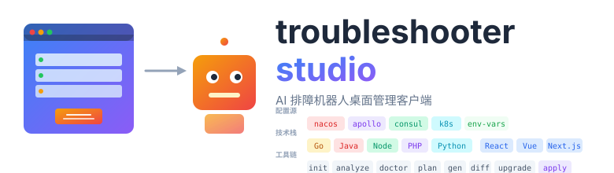

<p align="center">
  
</p>

# troubleshooter-studio

AI 排障机器人工作台。从代码仓库和运行环境创建机器人，用 Bug 工单驱动排障、修复和提交。

支持 **Claude Code、Cursor、Codex CLI、OpenCode**。每个机器人包含排障和修复两个 Agent，可在对应平台独立使用；桌面工作台提供工单管理、授权和故障闭环。

## 下载与安装

macOS 推荐桌面版，可从 [GitHub Releases](https://github.com/452562082/troubleshooter-studio/releases) 或 [GitLab Releases](https://gitlab.quguazhan.com/xiaolong/troubleshooter-studio/-/releases) 下载，也可使用安装脚本：

```bash
# GitHub 源
curl -fsSL https://raw.githubusercontent.com/452562082/troubleshooter-studio/main/scripts/install.sh | SOURCE=github bash

# GitLab 源
curl -fsSL https://gitlab.quguazhan.com/xiaolong/troubleshooter-studio/-/raw/main/scripts/install.sh | bash
```

脚本安装到 `/Applications` 并启动应用。指定版本时给右侧 `bash` 设置 `VERSION=vX.Y.Z`；私有 GitLab 需向下载请求传入令牌，并导出 `GITLAB_TOKEN`。桌面包未签名/公证；手动下载后若提示“已损坏”，确认文件来自上述发布源后可执行：

```bash
xattr -dr com.apple.quarantine /Applications/TroubleshooterStudio.app
```

Linux、Windows 使用发布页中的对应 CLI 二进制。Release 安装的是已发布版本；体验尚未发布的 `test` 分支改动请从源码构建。

## 第一次使用

先安装并登录至少一个 AI 平台的 CLI，再打开桌面端“创建向导”：

1. **选择项目**：选择本地仓库或填写仓库地址，检查扫描结果。项目名称自动填入，内部标识自动生成。
2. **运行方式**：选择 AI 平台、环境和分支；可检查模型连接。
3. **排障能力**：按需添加配置源、数据库与缓存、日志与服务状态连接。暂不需要的能力可以跳过；已添加的连接需补全并检查。
4. **确认并创建**：核对摘要并部署，在“已装机器人”查看结果、诊断或更新机器人。

接着在 **Bug 工单** 中配置工单平台、关联机器人与环境，选择工单进入 **故障闭环**：

```text
排障 → 授权修复 → 修复与工程测试 → 授权合并 → 提交 → 人工验收
```

排障输入来自工单信息、已有附件和补充说明。证据不足时可以补充后继续；代码修复与合并分别授权。提交完成不代表已部署或业务验收通过。详见[故障闭环](docs/incident-workflow.md)。

## 支持的平台

| 平台 | YAML target | 默认安装根目录 |
|---|---|---|
| Claude Code | `claude-code` | `~/.claude/` |
| Cursor | `cursor` | `~/.cursor/` |
| Codex CLI | `codex` | `~/.codex/` |
| OpenCode | `opencode` | `~/.config/opencode/`，支持 `XDG_CONFIG_HOME` |

Cursor 需要独立的 Agent CLI，仅安装编辑器不能执行后台排障。OpenCode 使用自己的模型账号配置，可运行 `opencode auth login`；也可通过 YAML 的 `agent.target_models.opencode` 指定 `provider/model`。

机器人按名称安装到平台的 agents、skills 等目录；运行时凭据使用 `~/.tshoot/<id>-creds.json`。共享路由按当前仓库选择机器人，未绑定仓库不会自动套用其他项目。

## 配置与 CLI

桌面端适合完整创建与故障闭环；CLI 适合脚本化生成、安装和更新。`tshoot serve` 提供轻量 Web/API，不等同于桌面端全部能力。

```bash
tshoot init -o troubleshooter.yaml
tshoot validate -i troubleshooter.yaml
tshoot gen -i troubleshooter.yaml -o dist/bot
tshoot install --path dist/bot-claude-code --target claude-code
```

以上以 Claude Code 为例；其他平台需在 `generation.targets` 中选择目标，并使用生成命令输出的对应目录。需要凭据时，安装命令可增加 `--env-file <凭据文件>`。部署后在桌面端运行机器人诊断，确认 MCP 能启动并列出工具。

`tshoot analyze` 扫描仓库，`plan` / `diff` 预览变化，`discover` 查找机器人，`apply` 更新已安装机器人；完整参数见 `tshoot --help`。

配置支持常见配置中心、数据库、缓存、消息队列及日志/指标/Trace/K8s 接入。示例见 [examples](examples/)，连接与兼容规则见[资源目录](docs/resource-catalog.md)。CodeGraph 为可选的仓库内代码查询能力，跨仓关系由服务拓扑提供；扫描无法识别的关系需人工补充。

## 从源码构建

使用 [go.mod](go.mod) 指定的 Go 版本和 [.nvmrc](.nvmrc) 指定的 Node 版本；macOS 桌面构建还需要 Xcode Command Line Tools。

```bash
make build          # CLI：bin/tshoot
make web            # 构建 Web 并更新内嵌资源；之后重新 make build
make desktop-app    # macOS：dist/TroubleshooterStudio.app
```

提交前使用 `make ci`，依赖准备与检查范围见[开发指南](CONTRIBUTING.md)。

## 文档

- [故障闭环](docs/incident-workflow.md)：工单输入、授权、提交和恢复。
- [排障方法](docs/troubleshooting-flow.md)：取证与结论边界。
- [资源目录](docs/resource-catalog.md)：连接、服务映射与配置兼容。
- [开发指南](CONTRIBUTING.md) · [测试指南](docs/testing.md) · [CI 与发版](docs/CI-RELEASE.md)。
- [架构决策](docs/decisions.md)：当前约束及其原因，历史方案通过 Git 追溯。

Apache-2.0，详见 [LICENSE](LICENSE)。
