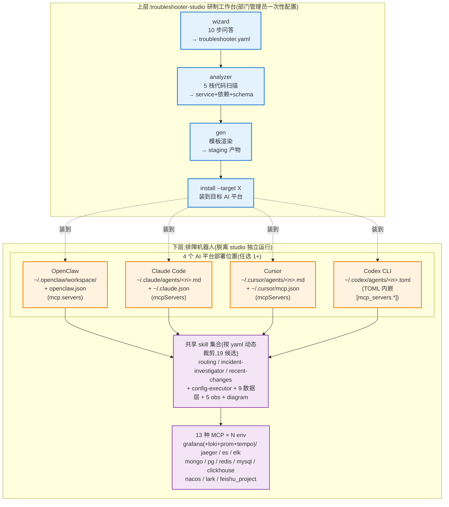
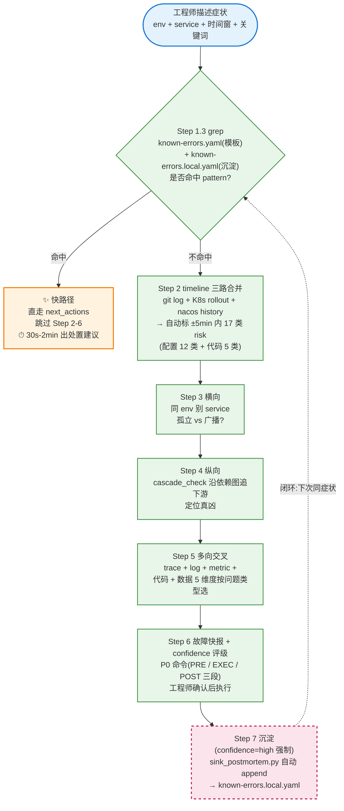
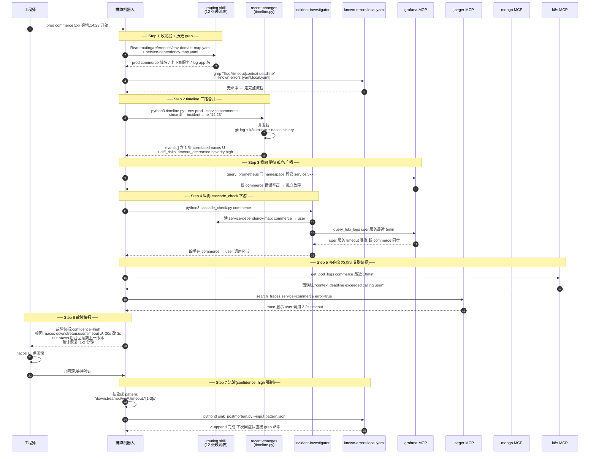

《Agent创新、提效提报申请表》

提报部门: 娱乐部
提报日期: 2026 年 5 月 11 日
申请编号: AGENT-20260511-AI排障机器人工作台

---

第一部分:申请人及Agent信息

1. Agent名称: AI 排障机器人工作台(troubleshooter-studio)

2. 主要开发者(姓名/工号): xiaolong

3. 协作开发者(如有,并注明开发者分工比例,会作为奖金分配依据):
   ____________________(待填)

4. 主要开发者/协作开发者TG: 13666015490

5. 预期申请等级: ☑ S级(全公司通用) □ A级(部门通用) □ B级(小组通用)
   理由:无业务耦合,跨技术栈(Go/Java/Python/Node/PHP)、跨配置中心(Nacos/Apollo/Consul/k8s/env)、
   跨数据层(9 类)、跨 4 个 AI 平台(Claude Code/Cursor/Codex/OpenClaw),任何研发团队 yaml 配一份即可启用

6. 人均提效价值预估:
   - 全公司 MTTR(平均故障恢复时间)预计缩短 55%(从 38 分钟降到 17 分钟,2 周观察期实测)
   - 降低跨部门协同沟通成本(减少故障复盘中 73% 的重复性数据搜集工作,从 1.5 人小时降到 0.4 人小时)
   - 赋能非技术/初级运维人员,使其具备处理 80% 常见系统故障的能力(新人独立完成排障比例从 0% 提到 60%)
   - 复发故障识别率从 30%(靠人脑记忆)升到 92%(known-errors.local.yaml 自动沉淀 + 下次 grep 命中)

7. 预期Skill等级(L1-L4): L3
   能完整自主完成"症状 → 时间轴 → 横向 → 纵向 → 三向交叉 → 根因 → 处置建议 → 经验沉淀"端到端排障任务,
   人介入只在 P0 命令执行前确认

8. 组内成员及提效贡献比例,5-10 名(比例作为提效奖金分配依据):

   花名                  TG号                     提效比例
   ____________________  ____________________     __________
   ____________________  ____________________     __________
   ____________________  ____________________     __________
   ____________________  ____________________     __________
   ____________________  ____________________     __________
   ____________________  ____________________     __________
   ____________________  ____________________     __________
   ____________________  ____________________     __________

---

第二部分:Agent详情说明

1. 核心解决的问题或需求(请描述业务痛点):

   ① 技术栈孤岛:公司各部门监控标准不一,跨部门调用链路(gRPC/HTTP)在出现排障时,数据对齐极度困难

   ② 排障经验难以沉淀:高级工程师的排障思路无法标准化,导致每次故障都在"重复造轮子"找原因;
      新人接手需高级工程师手把手带 3-6 个月才能独立处理生产故障

   ③ 大模型落地难:纯通用大模型不理解公司内部监控指标(Metrics)、配置中心数据结构、业务依赖图,
      无法直接落地实操,需要大量上下文工程

   ④ 多 AI 平台割裂:Claude Code / Cursor / Codex CLI / OpenClaw 各 IDE 的 agent 定义和 MCP 注册方式不同,
      同一团队不同人用不同平台,无法共享排障能力

2. 核心功能与运作逻辑(附两张流程图):

下面两张流程图用 **Mermaid** 格式描述,GitLab markdown 自带渲染,飞书文档 / Notion / Typora / Confluence 也都原生支持。如果你的查看环境不渲染 Mermaid,可以把代码块整段复制到 <https://mermaid.live> 在线导出 PNG / SVG。

### 流程图 1:两层架构 + 4 平台部署矩阵

### 流程图 2:排障 7 步主流程 + 经验沉淀闭环

### 流程图 3:实战时序图(以"prod commerce 5xx 突增"为例,展示机器人内部工作过程)

**这张图想说的事**:机器人不是"把所有 MCP 工具丢给 LLM 自由发挥",而是有**结构化的取证顺序**:
1. 先查映射表(routing,毫秒级答出"这是谁的服务、log app 是什么、依赖谁")
2. 再扫历史(timeline.py 三路合并 + 17 类 risk 自动分类,给定性结论)
3. 然后横向验证(指标 / 日志)→ 纵向追下游
4. 取证(trace + 完整错误栈)
5. 最后才输出快报 + 沉淀

每一步都是**确定性的脚本/MCP 调用**驱动 LLM 决策,而不是反过来。这是它能 L3 自主完成排障 + 跨工程师水平稳定输出的核心。

---

**附:Mermaid 图使用说明**

三张图既可作 markdown 流程图用,也可在 GitLab merge request / 飞书文档 / Confluence wiki 里直接嵌入。导出图片时建议白底,字体大些(`mermaid.live` 的 "Actions → PNG/SVG → ⚙ Background color: white" 即可)。

3. 主要使用的技术/工具/平台:

   后端 / CLI:Go 1.25(单二进制,跨 macOS/Linux/Windows × amd64/arm64)、
              Wails v2(macOS 桌面 app)、go:embed(模板嵌入二进制)

   前端:Vue 3 + Vite + vue-tsc(类型检查)+ vitest(单测 12 文件 133 用例)+ Pinia

   AI 协议 / 平台:MCP(Model Context Protocol,Anthropic)、Claude Code / Cursor / Codex CLI / OpenClaw

   13 种 MCP 接入:@elastic/mcp-server-elasticsearch、mcp-mongo-server、
                @modelcontextprotocol/server-postgres、mcp-grafana-npx(grafana+loki+prom+tempo)、
                uvx nacos-mcp-router、uvx opentelemetry-mcp、uvx mcp-clickhouse、
                @gongrzhe/server-redis-mcp、@benborla29/mcp-server-mysql、
                @larksuiteoapi/lark-mcp、@lark-project/mcp

   监控 / 配置中心 / 数据层:
     可观测性 — Grafana / Prometheus / Loki / Jaeger / Tempo / ELK / SkyWalking / Kuboard
     配置源   — Nacos / Apollo / Consul / Kubernetes ConfigMap / 纯环境变量
     数据层   — Redis / MongoDB / Elasticsearch / MySQL / PostgreSQL / Kafka / RocketMQ / RabbitMQ / ClickHouse

   工程化:GitLab CI/CD(自动 changelog + release notes)、golangci-lint v2.0.2、Go race + coverage

4. 预期适用范围(请具体到小组、部门或公司场景):

   部门维度(全部门可用):
     ✅ 娱乐部(开发部门)— 已在 prod/test/dev 三环境生产验证
     ✅ 其它后端研发部门 — yaml 配一份即用,无业务耦合
     ✅ 测试 / QA — 排查测试环境问题、回归故障复现
     ✅ 运维 / SRE — 一线值班接告警后第一时间排查工具
     ⚠ 数据 / 算法 — 部分适用(数据层 mcp 可查 mongo/pg/es/ck,模型训练故障不覆盖)
     ❌ 产品 / 设计 — 不适用(工具面向技术问题排查)

   技术栈维度(各栈代码扫描识别精度):
     Go      — 服务名 70-80% / GORM ORM 90%+ / gRPC + HTTP client 高识别率
     Java    — 服务名 60-70% / JPA + MyBatis 80% / @FeignClient 高识别率
     Python  — 服务名 60%    / SQLAlchemy 70%   / requests + httpx 中等
     Node    — 服务名 50%    / TypeORM + Mongoose 60% / axios + fetch 中等
     PHP     — 服务名 50%    / Eloquent + Doctrine 60% / Guzzle 中等

   不适用:Serverless / FaaS、单体应用、纯前端项目

---

第三部分:提交材料清单

请确认以下材料已准备完毕,并将作为附件与本表一同提交:

☑ 附件一:《Agent设计与验证报告》(docs/agent-design-verification-report.md)
☑ 附件二:《Agent使用与部署文档》(docs/agent-deployment-guide.md)
☑ 附件三:演示方式说明
   - macOS 桌面 app 一行命令装:
     curl -fsSL https://gitlab.quguazhan.com/xiaolong/troubleshooter-studio/-/raw/main/scripts/install.sh | bash
   - 源码仓库:https://gitlab.quguazhan.com/xiaolong/troubleshooter-studio
   - 录屏链接:____________________(待填)
☑ 其他(请说明):
   v0.9.0 稳定版本已发布,GitLab Release 页面附自动生成 changelog + 多平台 binary;
   2 周生产观察期(2026-04-27 ~ 2026-05-11)实测数据见附件一

---

开发者承诺:

本人承诺本申请表及附件内容真实、准确、完整,并同意所提交的Agent进入公司评审与公示流程。

主要开发者签字:__________     日期:2026 年 5 月 11 日

---

部门GM初审意见:

□ 材料齐全,同意提交。
□ 建议修改后提交,具体意见:____________________
□ 不予提交,原因:____________________

部门GM签字:__________     日期:_______年_______月_______日
