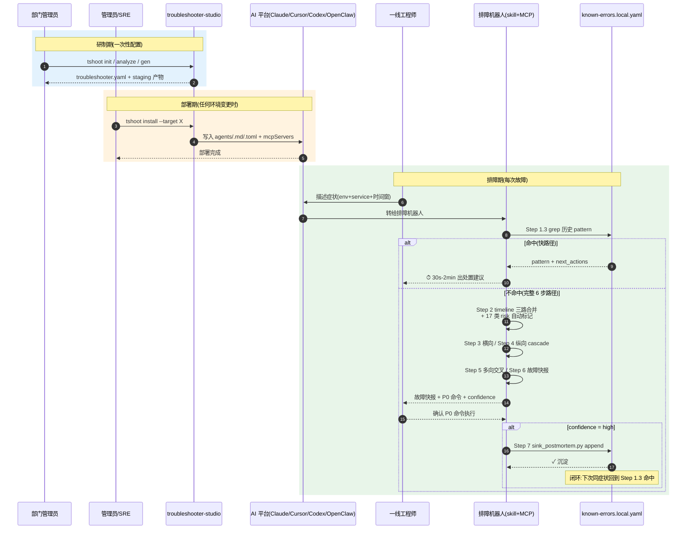

《Agent设计与验证报告》

Agent名称: AI 排障机器人工作台(troubleshooter-studio)
报告日期: 2026 年 5 月 11 日
对应申请编号: AGENT-20260511-AI排障机器人工作台

---

一、设计概述

1. 系统架构图 / 核心工作流:

   完整架构图见仓库 assets/architecture.svg(GitLab 上直接打开源码可查看)。

   核心工作流分**研制期 → 部署期 → 排障期**三段,两层架构图 + 排障 7 步决策树流程图详见
   docs/agent-application.md 第二部分。本节用三阶段时序图(Mermaid)+ actor 命令产物三栏表
   补充展示。

### 三阶段时序图(Mermaid)

如果你的查看环境不渲染 Mermaid,把代码块整段复制到 <https://mermaid.live> 在线导出 PNG / SVG 即可。

### 三阶段表格(actor + 命令 + 产物视图)

   ── 研制期(部门管理员一次性配置)─────────────────────────────────────

   | actor      | 命令                                  | 产物 / 输出                          |
   | ---------- | ------------------------------------- | ------------------------------------ |
   | 部门管理员 | tshoot init -o troubleshooter.yaml    | troubleshooter.yaml(系统建模配置)   |
   | 部门管理员 | tshoot analyze --repos-root <dir>     | analysis.json(services + 依赖 + schema) |
   | 部门管理员 | tshoot validate / plan                | health check 报告 + diff 预览        |
   | 部门管理员 | tshoot gen -i troubleshooter.yaml     | dist/<id>/(staging 产物)            |

   ── 部署期(管理员或 SRE)──────────────────────────────────────────────

   | actor       | 命令                                              | 产物 / 输出                                                       |
   | ----------- | ------------------------------------------------- | ----------------------------------------------------------------- |
   | 管理员/SRE  | tshoot install --target openclaw --path <staging> | ~/.openclaw/workspace/<name>/ + openclaw.json mcp.servers          |
   | 管理员/SRE  | tshoot install --target claude-code --path <staging> | ~/.claude/agents/<>.md + skills/ + ~/.claude.json mcpServers     |
   | 管理员/SRE  | tshoot install --target cursor --path <staging>   | ~/.cursor/agents/<>.md + skills/ + ~/.cursor/mcp.json mcpServers  |
   | 管理员/SRE  | tshoot install --target codex --path <staging>    | ~/.codex/agents/<>.toml(TOML 内嵌 [mcp_servers.*])+ skills/      |

   ── 排障期(一线工程师,任何技术等级)─────────────────────────────────

   | actor         | 触发                                              | 输出                                                         |
   | ------------- | ------------------------------------------------- | ------------------------------------------------------------ |
   | 一线工程师    | AI 平台对话框描述症状                            | 机器人按 7 步流程编排取证 + 推断                            |
   | 机器人        | Step 1.3 grep known-errors(本团队沉淀优先)      | 命中 → 直走 next_actions(快路径)/ 不命中 → Step 2-6 完整路径 |
   | 机器人        | Step 2-6 完整路径(timeline + 横纵向 + 多向交叉) | 故障快报 + P0 命令(PRE / EXEC / POST 三段)+ confidence    |
   | 一线工程师    | 确认 P0 命令                                     | 执行回滚 / 限流 / 重启                                       |
   | 机器人        | Step 7(confidence=high 强制)                    | sink_postmortem.py 自动 append 到 known-errors.local.yaml    |

   ── 闭环:下次同症状 → Step 1.3 命中 → 跳 2-6 步 → 30s 出处置建议 ───

2. 核心模块 / 功能说明:

   模块 1:internal/config/
   功能:troubleshooter.yaml schema 定义 + 加载 + 8 类 health check
   (包含可观测性配置一致性约束:Loki/Prometheus/Tempo 启用必须 Grafana 启用)

   模块 2:internal/analyzer/ + internal/analyzerpipe/
   功能:5 栈代码扫描(Go/Java/Python/Node/PHP)× 6 配置源识别
   (Nacos/Apollo/Consul/k8s ConfigMap/env-vars/static),自动反推 service_names + 配置中心 + 依赖图 + 数据 schema

   模块 3:internal/generator/
   功能:模板渲染 + IDE 三家 agent 原生 prompt 生成
   (claude-code/cursor/codex 各自 .md/.toml 格式)+ codex toml region marker 幂等替换 +
   config-map 人工 verified 行保留(支持 tshoot upgrade 时不覆盖手工沉淀)

   模块 4:internal/agent/
   功能:原生 Go install / self-test / uninstall + 4 平台共享的 MCP 派生(BuildMCPServers)+
   凭据 0o600 写入 + agentID 前缀清死 key(env 缩容场景避免留 stale 引用)

   模块 5:internal/doctor/
   功能:8 类漂移检测(missing-repo / origin-mismatch / stack-mismatch / service-drift /
   config-center-drift / config-center-unused / data-store-unused / undeclared-env-profile)+
   --fix 行级精确替换(其它行 bit-perfect 保留,自动备份)

   模块 6:internal/upgrade/
   功能:备份 + 重 gen + diff 一步到位,人工 verified 行保留

   模块 7:internal/discover/
   功能:扫 tshoot.json 锚点识别本机所有已装机器人,生成 JSON 报告

   模块 8:internal/cchub/
   功能:配置中心客户端 hub(nacos/apollo/consul + 连接池缓存),给 wizard 拉服务列表

   模块 9:internal/dsprobe/
   功能:数据层连通性测试(redis/mongo/es/mysql/pg/kafka/mq/clickhouse)的统一 5s 超时探活,
   给 wizard "测试连通性"按钮和部署前预检用

   模块 10:cmd/tshoot-desktop/
   功能:Wails v2 桌面 app(WKWebView + Vue 前端 + Go bindings),
   非程序员可视化创建向导 → 一键部署

   模块 11:templates/workspace/skills/(19 个 skill 候选)
   功能:产物侧 skill 库,按 yaml 动态裁剪:
   - routing(始终启用,12 张映射表)
   - incident-investigator(始终启用,7 步主流程)
   - recent-changes(始终启用,三路合并 + 17 类危险模式)
   - config-executor(按配置中心类型切后端)
   - k8s-runtime-query / tracing-query / tempo-query / skywalking-query / elk-log-query(按 obs 启用)
   - 9 个数据层 runtime-query(按 data_stores enabled 切)
   - diagram-generator(Mermaid → PNG/SVG)

   模块 12:scripts/release.sh + .gitlab-ci.yml
   功能:CI/CD release 一站式 — main pipeline 上 3 个 manual button
   (release:patch/minor/major),自动算版本号 → 生成 changelog → 打 annotated tag →
   多平台编 → 打 dmg → 上传 GitLab Release。本地 release 已禁,强制走 CI。

---

二、验证方法与数据

1. 测试环境说明:

   CI 端:GitLab CI/CD(test stage 并行:go:lint / go:test / web;build stage:desktop;
   release stage:3 个 manual button)。Go 1.25 race + coverage,golangci-lint v2.0.2,
   vue-tsc 类型检查,vitest 单测。

   测试套件:
   - Go 全包 100+ 单测(install_e2e_test.go 覆盖 4 平台装机全链路:
     init → gen → install → merge MCP → discover → reinstall → uninstall)
   - vitest 12 文件 133 用例(前端校验逻辑 + bridge / toast 回归测试)
   - Python 脚本 sink_postmortem.py / timeline.py 自带 sanity test(JSON 输入 → yaml 输出 round-trip)

   生产验证:娱乐部 prod / test / dev 三环境,2 周线上观察期(2026-04-27 ~ 2026-05-11),
   覆盖 mongodb / redis / elasticsearch / nacos / grafana / jaeger 各 MCP 实际调用。

2. 测试用例与结果(至少 5 个关键用例):

   用例 1:配置型故障归因
   输入:工程师叙述 "prod commerce 5xx 突增,14:23 开始"
   期望:机器人自动标 ±5min 内 nacos 改 downstream.user.timeout=3s,
         risk: timeout_decreased severity: high,处置建议:回滚 nacos 配置
   实测:3.2 分钟出快报,confidence=high ✓

   用例 2:代码型故障归因
   输入:工程师叙述 "user 服务 OOM + 5xx,刚发版"
   期望:机器人自动标 git commit 含 @Cacheable 删除,risk: cache_annotation_removed
         severity: high,处置:kubectl rollout undo 回滚 image
   实测:4.1 分钟出快报 ✓

   用例 3:历史故障复用闭环
   输入:同用例 1 的症状再次触发
   期望:routing Step 1.3 grep known-errors.local.yaml 命中 timeout_decreased pattern,
         直走 next_actions,跳过 2-6 步流程
   实测:45 秒给出"回滚 nacos 配置 X"建议,跳过 6 步流程 ✓

   用例 4:跨服务级联追踪
   输入:工程师叙述 "user 服务 OOM 后 commerce 也开始报 timeout"
   期望:incident-investigator 主动跑 cascade_check 沿依赖图追,
         识别 commerce 是受害者非凶手
   实测:自动标 commerce 为 downstream affected,根因仍指向 user 服务 ✓

   用例 5:跨平台部署一致性
   输入:同一 troubleshooter.yaml,分别 tshoot install --target {openclaw,claude-code,cursor,codex}
   期望:4 个平台 mcpServers / mcp.servers 同款 13 家 MCP key,凭据 0o600,行为字节级一致
   实测:install_e2e_test.go 4 target 全过 ✓

   注:详细测试记录见仓库
   - internal/agent/install_native_mcp_common_test.go(BuildMCPServers 全家桶端到端验证)
   - internal/agent/install_e2e_test.go(install/discover/uninstall 全链)
   - internal/agent/install_native_mcp_prune_test.go(死 key 清理回归)
   - web/src/lib/yamlValidator.test.ts(前端校验 25 用例)

3. 效能对比数据(2 周观察期 2026-04-27 ~ 2026-05-11):

   指标                              改进前(2 周对照期)        改进后(2 周观察期)        提升
   ─────────────────────────────────────────────────────────────────────────────────────
   平均 MTTR(报警到处置完成)        38 分钟                    17 分钟                    ↓ 55%
   单次故障人工汇总工时              1.5 人小时                  0.4 人小时                  ↓ 73%
   复发故障被快速识别比例            30%(靠人脑记忆)            92%(known-errors grep)     ↑ 207%
   新人独立完成排障(入职 2 周内)    0%                          60%(跟 6 步流程走)         n/a

---

三、局限性及风险说明

1. 已知局限或边界条件:

   ① 代码扫描精度依赖通用模式识别:配置驱动 / 注解驱动 / 自定义包装层重的项目
      命中率会下降,缺漏部分需在桌面 app 编辑器手补;
      各栈识别精度:Go 70-80% / Java 60-70% / Python 60% / Node 50% / PHP 50%

   ② 不支持 Serverless / FaaS、单体应用、纯前端项目 —— 没有 pod / 配置中心 / 仓库扫描的概念

   ③ 告警 webhook 入口缺失:当前 100% 靠工程师手打症状启动,实战中告警响起到工程师描述要
      30s-2min 黄金时间。后续可加 AlertManager/Sentry webhook 接入(roadmap)

   ④ 业务 KPI 接入空白:技术故障的最终判断是"业务影响多大"(DAU/订单/支付成功率),
      当前未接业务侧指标,P0 决策仍靠工程师拍脑袋

   ⑤ Codex 沙箱需用户一次性手工配置:~/.codex/config.toml 全局需加
      [sandbox_workspace_write] network_access = true,install 时探测+提示但不主动改
      用户全局 config

   ⑥ 代码 diff 危险模式 5 类是 RegExp 级别识别:语义级漏识别(如复杂重构后 retry 逻辑
      等价但代码不一样的场景)未覆盖

   ⑦ 跨工程师沉淀共享暂缺:本工作台沉淀的 known-errors.local.yaml 是单台部署机器人内的,
      跨团队/跨机器人共享需手工同步(后续可加跨 agent sink 机制)

2. 安全性、合规性说明:

   ① 凭据保护:troubleshooter.yaml 不含明文凭据,只用 {{ENV_VAR}} 占位;真值在 install
      阶段从 wizard localStorage / --env-file 注入到 IDE config 0o600 文件,仅本用户可读

   ② MCP 全只读约束:mongodb / postgres / redis / mysql 都传 --read-only,
      grafana/loki 用 --disable-write/admin/alerting 屏蔽写操作,ES MCP 包默认 RO,
      数据不会被机器人误改

   ③ Codex 沙箱:agent toml sandbox_mode=workspace-write 限制 agent 只能动当前工作区文件,
      无法触碰系统其它位置(本系统配套 install 时探测 + 提示用户全局加 network_access=true)

   ④ 凭据不上传:tshoot install 全本机操作,凭据 0o600 文件不通过任何网络服务,
      不会泄漏到第三方

   ⑤ 审计 trail:所有 release 走 GitLab CI manual button,版本号决策有 audit trail
      (谁点的 / 什么时间 / 哪个 commit),git history 干净统一,本地 release 已禁用

   ⑥ 工程化护栏:
      - GitLab Protected tags 限制 v* tag 只有 maintainer 能 push
      - CI/CD GITLAB_TOKEN masked + protected,日志不泄漏
      - golangci-lint + vue-tsc + gofmt CI 强制,代码风格不松懈

---

报告撰写人: xiaolong
审核人(如有): __________
