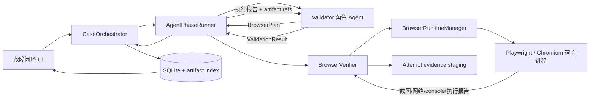

# 验证 Agent 渲染浏览器取证设计

日期：2026-07-15

## 目标

当 Bug 提供可访问的 Web 入口和复现步骤时，Studio 的 validation / regression 阶段必须能够主动操作真实渲染页面，并把本轮截图、脱敏网络记录、console 和执行轨迹登记为 Case 证据。验证 Agent 不应因为后台 CLI 没有 in-app browser，就退化成只重放接口并要求用户提供页面截图。

验收口径：给定可访问页面和只读复现步骤，validation 或 regression attempt 必须生成可在故障闭环页面查看的本轮渲染截图；没有截图且没有明确的浏览器运行时错误、登录阻塞或业务输入缺口时，不允许报告验证完成。

## 背景与根因

仓库已经存在浏览器采集脚本：

```text
templates/workspace/skills/frontend-repro-investigator/scripts/browser_collect.mjs
```

脚本可以输出 `screenshot.png`、`network.har`、`console.jsonl` 和 Playwright trace，但它目前只是可选能力，不是 Studio 闭环保证的运行时能力。

本次只读调查得到三个直接证据：

1. 在当前项目环境直接运行采集器，返回 `code=3` 和 `optional dependency playwright is not installed`。
2. `validationAgentExecutionGuidance()` 明确告诉 Agent：“不保证拥有 in-app browser；不可用时退化到附件、HAR、API、trace 或日志”。因此截图中的 Agent 按现有规则只验证了搜索 API。
3. 持久化 `AgentPhaseRunner` 把用户选中的基础机器人原样用于 validation / regression；只有旧 `CodexInvestigator` 链路会调用 `ValidatorBotFor(...)`。因此新闭环没有稳定切换到已生成的 validator 角色工作区。

根因不是模型忽略指令，而是 Studio 只生成了浏览器脚本，没有提供可保证启动的宿主运行时、角色路由和闭环证据协议。

## 已确认的产品选择

- 采用 Studio 宿主浏览器执行器，不依赖 Agent CLI 沙箱直接启动 Chromium。
- 有页面和复现步骤时自动执行浏览器验证；登录态缺失时再请求用户处理。
- 用户在 Studio 打开的验证浏览器中手动登录，不把账号、密码或 Cookie 粘贴进 Case 补充文本。
- validation / regression 真正使用 validator 角色。
- 正常成功至少产出最终渲染截图；失败至少产出失败现场截图和明确失败步骤。
- 页面直接预览截图，而不是只显示 artifact 文件路径。

## 非目标

- 不绕过验证码、MFA、设备验证或企业 SSO 安全策略。
- 不允许 Agent 执行任意页面 JavaScript。
- 不在生产环境自动执行有业务写副作用的页面操作。
- 不实现多浏览器矩阵、移动设备云或视觉回归像素基线。
- 不把原始 Cookie、Authorization、密码、完整未脱敏 HAR 或原始 Playwright trace 写入 SQLite 和 artifact。
- 不以 `danger-full-access` 或关闭 Codex 沙箱作为浏览器能力方案。

## 方案比较

### 方案 1：Studio 宿主浏览器执行器（采用）

验证 Agent 生成声明式操作计划；Studio 在沙箱外运行固定版本 Playwright/Chromium，采集并脱敏证据；验证 Agent 再根据执行报告输出最终验证结果。

优点：

- 不受 Codex macOS MachPort 沙箱影响。
- Codex、Claude Code 和 OpenClaw 行为一致。
- 浏览器、登录态、URL 策略和证据脱敏都由 Studio 控制。
- 可以使用 fake executor 做稳定离线测试。

代价：

- validation / regression 从一次 Agent 调用变成计划、执行、结论三段式。
- Studio 需要管理 Playwright 运行时和浏览器进程生命周期。

### 方案 2：Agent 工作区直接运行 Playwright（拒绝）

继续使用现有 `browser_collect.mjs`，在每个生成工作区安装 Playwright。

优点是改动小，但 Codex 沙箱仍可能拒绝 Chromium MachPort；每个平台、每个工作区都要维护依赖，无法把截图能力定义成产品保证。

### 方案 3：外部 Browserless / Playwright Grid（拒绝）

能力稳定且适合集中式 CI，但给当前单机桌面产品增加外部服务、凭据、网络和运维依赖，不符合当前边界。

## 总体架构



浏览器运行在 Studio 宿主边界，Agent 负责理解 Bug、生成操作计划和判断验证结果。Studio 负责执行受限操作、保管登录态、脱敏证据和推进状态。

## 组件设计

### 1. Phase 角色解析

新增统一的 phase → execution bot 解析：

```text
validation  -> ValidatorBotFor(selected)
regression  -> ValidatorBotFor(selected)
investigation -> selected
fix -> 维持当前行为，本设计不扩修复角色范围
```

`IncidentCase.SelectedBotKey` 继续保存用户选择的基础机器人。执行时根据 `PhaseAttempt.Phase` 派生 validator，避免为同一个 Case 改写基础选择。恢复流程使用相同解析函数，不能在重启后退回 troubleshooter 工作区。

如果老安装没有对应 validator 定义或工作区，validation 不得静默使用排障角色伪装成功。Case 返回可操作的 `validator_not_installed` 系统错误，提示重新部署机器人。

### 2. BrowserRuntimeManager

职责：

- 在 Studio 管理目录安装固定版本的 Playwright 和 Chromium。
- 运行时只维护一份共享浏览器依赖，不复制到每个机器人工作区。
- 安装完成后执行真实 launch、打开本地测试页和截图 probe。
- 暴露 `ready`、`installing`、`broken` 和诊断码。
- 安装或修复过程向 UI 发送进度，不让用户面对静默下载。

运行目录不进入业务仓库，也不写 Agent workspace。版本必须固定；升级需要校验安装和真实 smoke probe，不能只判断 npm 命令成功。

默认测试不联网下载 Playwright。单元和集成测试使用 fake runtime；真实 smoke test显式启用。

### 3. BrowserVerifier

Go 接口负责把声明式计划交给宿主 worker：

```go
type BrowserVerifier interface {
    Execute(context.Context, BrowserVerificationRequest) (BrowserVerificationResult, error)
}
```

请求至少包含：

- Case、cycle、attempt ID。
- system、environment、是否生产环境。
- 允许访问的 frontend/auth/API origins。
- `BrowserPlan`。
- Studio evidence staging 的 opaque handle。
- 可选的加密登录 session 引用。

结果至少包含：

- 每一步的开始、完成、失败和耗时。
- 最终 URL、页面标题和安全的可访问性摘要。
- 登录是否必需。
- 失败步骤和结构化错误码。
- 已写入 staging 的 screenshot、network、console 和 action trace 相对路径。

接口不接收任意 shell 命令和 JavaScript。

### 4. BrowserPlan

规划调用必须只输出严格结构：

```yaml
version: 1
start_url: "https://test.example.com/users"
actions:
  - id: open-user-tab
    action: click
    locator:
      kind: role
      value: tab
      name: 用户
    screenshot_after: true
  - id: enter-keyword
    action: fill
    locator:
      kind: placeholder
      value: 请输入用户昵称
    value: 汤圆
  - id: wait-results
    action: wait_for
    locator:
      kind: text
      value: 搜索结果
    screenshot_after: true
assertions:
  - kind: visible_text
    value: 汤圆
```

允许的 action：

- `goto`
- `click`
- `fill`
- `press`
- `select`
- `wait_for`
- `screenshot`

locator 优先级：`role`、`label`、`text`、`placeholder`、`test_id`，`css` 只作兜底。禁止 XPath 注入、`evaluate`、自定义脚本、浏览器扩展和任意文件上传。

worker 在执行前完整校验计划。密码字段、文件上传、越权 origin、生产写操作或未支持动作直接拒绝，不开始部分执行。

### 5. Browser-assisted validation coordinator

Web 场景触发条件：

- Bug 有 `frontend_url`；或
- 最新用户补充明确要求 Web / 页面 / 浏览器复现。

执行流程：

1. 解析 validator execution bot，并 preflight validator 与浏览器运行时。
2. 第一次 Agent 调用生成 `BrowserPlan`，不能提前输出验证成功。
3. Studio 校验 URL 和动作计划。
4. `BrowserVerifier` 在宿主进程执行计划，并把证据写入当前 attempt staging。
5. 如果 locator 失败，把失败步骤和脱敏可访问性摘要交给 validator 修正剩余计划一次。
6. 第二次失败后停止，保留失败截图，不继续无限尝试。
7. 最终 Agent 调用读取执行报告、页面观察和 artifact refs，输出既有 `ValidationResult` YAML。
8. Runner 继续执行现有环境校验、敏感信息扫描、artifact 登记、completion intent 和 `CompleteAttempt`。

最多三次 Agent 调用都属于同一个 `PhaseAttempt`，usage 汇总到该 attempt：正常路径是规划 + 结论两次，只有 locator 首次失败时才增加一次修正调用。Browser plan 和修正报告是内部执行数据，不冒充最终 `ValidationResult`。

非 Web 场景继续走现有 API、附件、trace 或日志验证，不强制启动浏览器。

### 6. 计划修正边界

首次 locator 失败时，worker返回：

- 失败 action ID。
- Playwright 错误分类，不返回含秘密的完整堆栈。
- 当前 URL 和页面标题。
- 有界、脱敏的 accessibility nodes：role、name、visible/disabled 状态。

validator 只能重写失败步骤及后续步骤，已经完成的步骤不可重复。最多一次修正。URL 策略、生产限制和禁止动作在修正后重新完整校验。

## 登录态设计

### 登录检测

以下任一条件触发 `browser_login_required`：

- 跳转到配置的 auth origin。
- 页面出现可见 password 输入框。
- 主文档或关键 API 返回 401/403。
- 计划期望业务页面，但最终稳定停在已知登录 route。

触发后不截取登录表单、不尝试填写密码。Case 使用现有 `waiting_evidence` 状态并记录稳定的 `browser_login_required` error code，UI 据此把主动作改为“打开验证浏览器完成登录”；本设计不为登录单独增加 Case 状态。

### 人工登录

Studio 打开可见的宿主浏览器窗口，用户自行完成登录。登录成功后，Studio 只保存 Playwright `storageState`，不记录用户输入。

为避免 Cookie 明文落盘：

- 每个 system/environment/origin 生成随机 AES-GCM key。
- key 存系统 Keychain / Credential Manager / Secret Service。
- 加密后的 session 文件放 Studio 管理目录，权限限制为当前用户。
- Linux 无可用 keyring 时只保留内存 session；应用退出后需要重新登录，不退化成明文持久化。
- UI 提供“清除此环境登录态”。

登录完成后继续同一 Case 和 cycle，并创建父链明确的新 validation/regression attempt；不重置 Case。原登录阻塞 attempt 保留审计记录，新的 attempt 复用加密 session 引用但不把 Cookie 写进 input JSON。

## URL 和操作安全

允许 origin 来自当前 Bug/环境的正式配置：

- frontend origin。
- 明确配置的 auth origin。
- 浏览器会访问的 API origin。

规则：

- 永久禁止 `file:`、`data:`、`javascript:`、浏览器内部 scheme 和云 metadata。
- DNS 解析后重新校验实际 IP，防止重绑定。
- 私有地址只允许配置中精确声明的环境 origin，不能由 Agent 临时扩权。
- 跨 origin redirect 必须仍在 allowlist 中。
- `is_prod=true` 时自动模式只允许导航、等待和截图；点击、填充、按键或选择需要未来单独的生产交互授权，本设计不实现该授权，因此直接停止。
- 非生产环境也只能执行 Bug 复现步骤中的操作，不提供通用浏览器代理。

## 证据处理

### 截图

- 每个 `screenshot_after` 步骤产生一张 PNG。
- 成功必须有最终截图；失败必须有失败现场截图。
- 登录表单和 password 字段可见时不截图。
- 截图文件进入当前 attempt staging，再走现有安全打开、fstat、SHA256、大小限制和 artifact 登记。

### 网络记录

不登记 Playwright 原始 HAR。宿主 worker先生成脱敏 network JSON/HAR：

- 删除 `Cookie`、`Set-Cookie`、`Authorization`、proxy auth 和认证 challenge。
- 脱敏 token、password、secret、code、session 等 query/form 字段。
- 响应 body 默认只保留 content type、长度、状态和有界摘要；敏感或二进制 body 不保存。
- 保留 method、脱敏 URL、status、duration、request ID 和 trace ID。

### Console 和执行轨迹

- console 文本经过现有敏感信息扫描和长度限制。
- 不登记原始 Playwright `trace.zip`，因为其中可能包含 DOM snapshot、Cookie 和请求体。
- 改为登记 Studio 生成的 `browser-actions.json`：动作 ID、locator 类型、开始/结束时间、结果和错误码，不包含输入秘密。

Runner 的最终敏感信息扫描仍保留，宿主脱敏不能绕过第二道防线。

## 状态和错误映射

| 场景 | Case 行为 | UI |
|---|---|---|
| 浏览器运行时准备中 | attempt 保持运行 | 显示安装/启动进度 |
| validator 未安装 | 不启动浏览器 | “重新部署验证机器人” |
| Playwright/Chromium 损坏 | 系统错误，不伪装业务 gap | “修复浏览器环境并重试” |
| 登录态缺失 | 等待输入，保留父链 | “打开验证浏览器完成登录” |
| 缺 URL/测试数据 | `waiting_evidence` | 列出最小业务缺口 |
| locator 首次失败 | 同 attempt 修正一次 | 显示失败步骤和正在修正 |
| locator 再次失败 | `waiting_evidence` | 显示失败截图和具体步骤 |
| 页面验证完成 | 继续严格 `ValidationResult` 校验 | 展示验证结论和证据 |

系统错误必须有稳定 error code，不能让 Agent把“Playwright 未安装”写成用户需要提供 HAR。

## UI 设计

### 过程状态

阶段输出中显示：

```text
准备验证浏览器
执行 1/4：打开用户页
执行 2/4：切换到“用户”
执行 3/4：输入“汤圆”
采集渲染截图和 Network
生成验证结论
```

这些消息来自 worker 和 runner 的结构化事件，不依赖 Agent 自由文本。

### 登录阻塞

`browser_login_required` 时，当前状态卡显示：

- 需要登录的系统、环境和 origin。
- “打开验证浏览器完成登录”。
- “清除此环境登录态”。
- 不提供账号密码文本框。

### 证据预览

`BugCaseArtifacts` 对 `kind=screenshot` 显示缩略图，点击打开原图。预览通过新的按 Case ID + artifact ID 读取 binding，后端必须重新验证 artifact 归属、文件类型、大小和安全路径；前端不能直接读取 `path_or_reference`。

HAR/network、console 和 action trace 显示类型、采集时间、环境和安全打开/下载入口。内部绝对路径不作为主要用户信息。

## 崩溃恢复与幂等

- Browser plan、执行 reservation 和已完成步骤写入 attempt 专属 staging journal。
- worker启动前写 reservation，完成证据后写 result manifest，均使用临时文件 + fsync + rename。
- 重复命令先检查 manifest 和已登记 artifact SHA，不重复登记证据。
- validation/regression 是只读阶段；重启后只有完整计划被验证为非生产、无受限动作时才允许从头重跑一次。
- 登录阻塞通过新的父 attempt 继续，不保持无人管理的长期 Chromium 进程。
- 系统不把半张截图、未完成 HAR 或没有最终 manifest 的目录当作成功证据。

## 测试策略

### 单元测试

- phase → validator role 解析和旧安装缺 validator。
- BrowserPlan strict decode、未知字段、禁止动作和 locator 校验。
- URL allowlist、redirect、DNS/IP、private origin 和 metadata 拒绝。
- 登录检测和 password 字段禁止截图。
- HAR/network、console、URL 和 action trace 脱敏。
- 一次计划修正上限。
- session 加密、keyring 不可用时内存降级和清理。

### Runner / Orchestrator 集成测试

- validation / regression 使用 validator workspace；investigation 保持基础机器人。
- planner → fake BrowserVerifier → evaluator 的完整 happy path。
- 最终截图进入当前 attempt staging 并登记为 `EvidenceArtifact`。
- 无截图的 Web 成功结果被拒绝。
- 登录阻塞创建同 Case/cycle 的父链 continuation。
- runtime 错误不变成业务 `gaps`。
- completion intent、重复回调、SQLite reopen 和 artifact 幂等。
- interrupted browser reservation 的安全恢复。

### UI 测试

- 浏览器步骤进度显示。
- 登录按钮、清理登录态和恢复验证。
- screenshot 缩略图与安全预览。
- 浏览器系统错误与业务缺口使用不同文案和动作。
- artifact 路径不直接用作 ``。

### 真实 smoke test

显式测试启动本地 HTTP 页面，执行点击、填充和等待，断言：

- PNG 非空且来自最终渲染页面。
- network 证据包含本地 API 且不含测试 Cookie/Authorization 原值。
- console 证据包含测试消息且已脱敏。
- `browser-actions.json` 包含已完成步骤。

默认测试不访问业务环境、不下载浏览器、不修改真实登录态。

## 文档和决策同步

实施时需要同步：

- `docs/incident-workflow.md`：validation / regression 的宿主浏览器流程。
- `docs/troubleshooting-flow.md`：浏览器证据不再是可选用户附件。
- `templates/workspace/skills/bug-verifier/SKILL.md.tmpl`：优先调用正式 BrowserVerifier，而不是直接启动 Playwright。
- `templates/workspace/skills/frontend-repro-investigator/SKILL.md.tmpl`：现有脚本降为手动/兼容路径。
- `CONTRIBUTING.md`：浏览器 fake、smoke、安全和恢复测试要求。
- `docs/decisions.md`：追加“验证浏览器由 Studio 宿主持有”的 ADR；不修改历史条目。

## 完成定义

- Web validation / regression 真实使用 validator 角色。
- Studio 能安装、probe、修复固定浏览器运行时。
- 给定本地可访问页面和复现步骤，闭环生成本轮渲染截图、脱敏 network、console 和 action trace。
- 截图能在 Case 页面安全预览。
- 登录态缺失时由用户在验证浏览器中手动登录，秘密不进入 Case 和 artifact。
- 无截图的 Web 成功结论被后端拒绝。
- 计划最多修正一次，重启和重复命令不会重复浏览器副作用或证据。
- 相关 Go、前端、脚本、安全、恢复和本地真实浏览器 smoke 测试通过。
