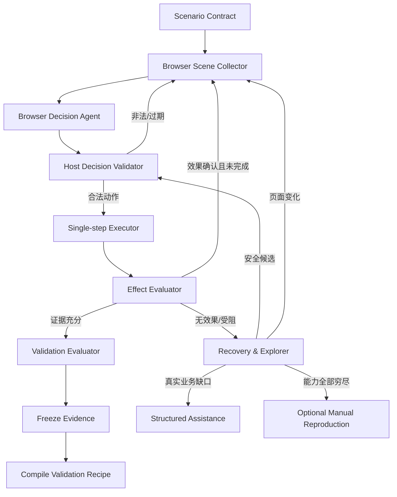

# 浏览器验证 Agent 自主闭环设计

> 状态：分阶段实施中；本文描述目标架构，已生效边界以 `docs/decisions.md` 为准。
> 日期：2026-08-04
> 适用范围：Studio 持久化 Case 的 Web `validation` / `regression`；不改变 API/纯后端验证链路。

当前进度：`BrowserScene v1`、Host 绑定/脱敏/完整性校验、runtime r49/probe v7、场景辅助规划与 repair、`BrowserDecision v1` 严格解析、当前 BrowserPlan 的值无关 `browser_step_effects` 冻结证据与判定输入、schema v12 动作级事务日志，以及 Decision→Scene→冻结 Plan→Executor→Effect 的 Host 事务管线已落地，并已禁止 start replay/执行中断时重复动作；Node Worker 已提供受限 JSONL 持久单步会话并由真实 Chromium runtime probe 覆盖，Go Host 也已具备同进程 JSONL 驱动、严格结果解码、URL/Scene 再校验、Host identity 重新绑定和冻结证据回调，可直接作为动作事务 Executor。Host 侧有界探索 guard 已实现状态/动作语义指纹、24/10/16 预算、失败边去重、同 Scene 决策纠正上限和低风险动作证明；确定性候选生成器只从唯一的当前 Scene 语义产生同源 goto 和 ARIA tab，并可按明确 ref 产生被动 wait，随后以不修改冻结 BrowserPlan 的临时 binding plan 交给 Decision。Shadow `BrowserDecisionLoop` 已串起严格决策、候选、绑定预检、journal、持久单步 Executor、effect 和 after-scene，错序/伪造决策只走有界纠正；terminal journal 可通过 attempt 绑定、严格 JSON、Scene digest 校验的冻结 Scene loader 恢复且绝不重放动作。真实 `PhaseAgentExecutor` 已有严格单 Decision provider 适配层，提示词不投射冻结 fill 值、locator 或宿主路径。Host recovery candidate builder 会把普通 Scene 安全候选与明确的 wait 元素、已确认非业务遮挡 surface 合并，仅生成 wait 或 Escape，不从页面文案推断遮挡性质；配置 Host-owned recovery provider 后，no-effect/blocked 会进入这些候选的有界调度，恢复期间禁止 Validator 直接重试业务动作，只有 Worker 证明未派发或 Host 证明动作前遮挡已移除才重新开放原动作，ambiguous/uncertain 仍停止。保守 recovery evidence adapter 已消费持久 Worker 的结构化状态：scene stale 以及 locator 不存在/不唯一、活动 surface 不存在、全局按键被禁等明确动作前失败标为 `not_dispatched`；点击拦截、超时、输入未保持及通用失败保持 unknown，journal replay 也不继承内存证明。Recipe v3 已从 confirmed Host trace 自动编译并由 schema v13 持久化；完全匹配场景合同和 Plan 摘要时优先以 test-id/label/placeholder/role/scoped-role/same-origin-href 多锚点在当前 Scene 唯一重绑定，歧义、漂移和 recovery 自动回退普通 Decision provider。临时 element ref 不持久化，effect 的目标引用使用占位符并在当前 Scene 重新绑定。loop 同时输出不含页面内容的灰度计数指标，并可通过现有 InvestigationEvent 回调在任意终态恰好发送一次；独立聚合器可严格消费 JSON 往返后的计数事件。非生产灰度门禁已实现按 Case 稳定分桶、生产硬禁止、Host 能力完整性检查和默认 0% fail-closed 策略；benchmark 评估器与只读真实历史采集器已把完成率、一致性、人工介入、当前证据和动作安全阈值固化，关键 corpus 缺失时不能通过。Coordinator 已接入可选的自主 runner 灰度缝：只有门禁命中才调用，默认仍走旧 Verifier；自主 runner 启动后若报错绝不回退并重复旧 BrowserPlan。Worker 的 `finish` 协议会在断言后生成最终截图及 Network/Console/action/effect 证据；`HostVerifier` opener 在同一进程会话内冻结 attempt-scoped Scene，最终复用既有 artifact manifest 校验，通用 Host runner 已能组合 opener、Decision、journal、recovery 和 evidence。`AgentPhaseRunner` 已正式组合支持 opener 的 HostVerifier、真实 Decision provider、step store 与保守 recovery；每次 Decision Agent token 会汇总到 Attempt usage，readiness 由冻结场景合同、当前前端入口、非生产策略、已解析测试输入和已打开登录会话生成，已存在安全直接目标时探索会被拒绝。配置入口显式默认 0%，因此注册本身不新增事件或改变旧 BrowserPlan 路径。手动复现入口已经切换为 Host capability-gap 证明门禁。当前剩余项是隔离非生产测试站产生足量真实自主样本；BrowserPlan 默认路径仍不变。

最新验证补充：runtime 已升级到 r58/probe v16。Worker 会在任意已完成状态动作后，只读等待冻结 Plan 的下一唯一可见目标并滚入 viewport；歧义、超时或不可见仍 fail closed。BrowserScene 首批 8 个控件并行采集且保持 DOM 顺序，避免慢 SPA 的首个节点独占 3 秒采集预算。Funhub 隔离测试站的真实 Host DecisionLoop 已在 159.60 秒内完成导航、fill、提交、用户 tab、最终断言和 artifacts，全程不需要用户手动复现。该 deterministic smoke 不计作真实 Decision Agent benchmark 样本；rollout 仍为 0%。本段 supersedes 上方 r49/probe v7 的 runtime 现状描述。

2026-08-05 浮层关闭补充：遮挡恢复与显式浮层关闭已统一为 Host-owned `dismiss_surface`；存量 v2 无 locator Escape 仅作为兼容输入。Worker 冻结活动浮层后有界选择 Escape 或安全关闭控件，并验证精确浮层消失，Decision/Recipe 不再生成关闭机制 locator。runtime 已升级到 r60/probe v18。

部署侧灰度配置来源现已落地：桌面端启动时从 `~/.tshoot/config.json` 读取可选的 `browser_decision_rollout`，在创建 workflow runtime 前执行同一 policy validator，并只读暴露当前进程实际生效状态。配置缺失仍是 0%；非法版本或比例不会留下半初始化 runtime。运营方必须显式编辑配置并重启 Studio，普通 UI 没有写入口：

```json
{
  "browser_decision_rollout": {
    "version": 1,
    "enabled": true,
    "percentage": 10
  }
}
```

`percentage` 只能是 0–100 的整数，且不能绕过生产硬禁止、Host capability、readiness 或按 Case 稳定分桶。历史 benchmark 已可自动采集并 fail-closed；当前剩余项是在隔离非生产测试站产生真实灰度样本。

## 1. 摘要

本方案保留 Studio 宿主持有的固定 Playwright / Chromium、URL 策略、登录态、证据冻结和生产环境限制，不把浏览器控制权直接交给 Agent。改造重点是把当前“预先生成 BrowserPlan，失败后有限观察修复”升级为“场景合同固定、每次状态变化后重新观察、单步决策、宿主执行、效果确认、自动探索、成功路径沉淀”的自主闭环。

目标不是承诺所有 Case 都能自动成功，而是同时做到：

- 普通 DOM / SPA 场景尽可能由 Agent 自主走完整流程；
- locator、菜单、弹窗、异步渲染和页面改版不得直接转成用户手动复现；
- 每次状态动作必须有可验证效果，不能把 Playwright 调用返回当作业务成功；
- 无法继续时给出稳定、可归属的阻塞原因；
- 手动复现只在自动观察、结构化定位、视觉定位和安全探索均穷尽后，由用户主动选择；
- 回归优先确定性重放首次自主验证沉淀的配方，页面漂移时只修复定位，不改变场景语义。

推荐先实现自研 `BrowserScene + BrowserDecision` 协议。Playwright MCP 的 accessibility snapshot / element reference 设计可作为实现参考；Stagehand 仅作为可插拔、只提供候选的 grounding 实验，不直接执行动作。首版不引入 Browser Use 或 Skyvern 作为主执行器。

## 2. 背景与现状

### 2.1 当前可靠边界

当前架构已经具备以下不可退让的能力：

- Validator 只生成声明式 BrowserPlan，Studio `HostVerifier` 执行动作；
- 固定 Playwright / Chromium runtime 经过真实 launch、页面和 PNG semantic probe；
- URL、DNS/IP、redirect、origin、生产动作和受控文件上传由宿主校验；
- Cookie、Authorization、storageState 和密码不进入 Case 文本；
- 最终结论绑定当前 attempt 的冻结截图、Network、Console、action trace 和 artifact digest；
- locator 失败后已有观察驱动的继续、提问或结论检查点；
- 首次验证成功后冻结 `ValidationRecipe`，回归不得改变场景合同；
- 手动复现已经可以生成脱敏、可回放配方。

本方案不得破坏这些边界。

### 2.2 当前主要缺口

当前观察驱动循环主要发生在 locator/action 失败之后，正式执行仍以预先生成的完整 BrowserPlan 为主，存在以下问题：

1. `accessibilitySummary()` 先取 DOM 前 24 个 `a/button/input/select/textarea/[role]`，再过滤可见性。隐藏或无关节点可能消耗额度，真实控件不一定进入 Agent 上下文。
2. 当前摘要不是完整 accessibility scene。native implicit role、iframe、shadow DOM、viewport、遮挡、活动浮层、稳定元素身份和元素关系表达不足。
3. Agent 在初始页面上提前规划后续页面 locator。SPA、弹窗和异步渲染改变 DOM 后，后续动作天然容易过期。
4. Playwright Locator 是活查询。若宿主把 `nth()` 或查询下标误当固定元素身份，DOM 变化后可能重绑定到另一个元素。
5. `click/fill/press` 返回 completed 只证明自动化 API 调用完成，不证明输入保持、提交发生、请求发出或业务页面改变。
6. 当前恢复规则分散在 locator repair、活动浮层识别、遮挡恢复和 evaluator 中；新增组件形态容易继续堆叠特判。
7. locator、协议、Provider、业务歧义和缺少测试资料虽然已有分类，但用户入口仍可能过早出现手动复现。

### 2.3 问题定义

需要解决的不是“换掉 Playwright”，而是补齐 Playwright 之上的五层能力：

```text
页面观察 → 元素 grounding → 动作决策 → 动作效果确认 → 有界探索与恢复
```

## 3. 目标与非目标

### 3.1 目标

- 每个状态改变动作后都生成新鲜 `BrowserScene`，旧元素引用自动失效；
- Validator 一次最多决定一个状态改变动作和有限被动检查，不再提前猜完整未知页面；
- Host 根据当前 scene 校验元素身份、唯一性、viewport、活动浮层和动作风险；
- locator 缺失时先确定性 grounding，再结构化 AI grounding，再视觉 grounding，最后才判定能力缺口；
- 页面入口、菜单、tab 和展开控件允许在非生产环境内进行有界安全探索；
- 每个动作声明并验证后置效果；无效果时自动重新观察、恢复或选择其他策略；
- 成功自主验证自动编译成带前置条件、多个定位锚点和后置条件的可重放 recipe；
- 中断、重启和模型传输失败不重复未知副作用；
- 失败输出能区分系统、环境、登录、测试资料、业务语义、页面能力和安全授权。

### 3.2 非目标

- 不保证任意网页、任意权限和任意业务描述都能自动验证；
- 不开放任意 JavaScript / evaluate、XPath、Cookie、header、storageState 或宿主路径；
- 不让外部 Agent 框架直接持有浏览器、登录态或 artifact staging；
- 不用视觉模型绕过 origin、生产动作和唯一目标校验；
- 不在本次设计中替换 Case 状态机、验证确认门或部署后回归语义；
- 不把 CAPTCHA、MFA、密码输入伪装成自动化能力；
- 不要求业务系统必须立即补齐 `data-testid`，但允许将其作为最高优先级稳定锚点。

## 4. 设计原则

1. **Host 是唯一执行和安全边界**：Agent、页面文本、accessibility 内容和第三方 grounding 输出都视为不可信输入。
2. **场景语义与页面定位分离**：`scenario_contract` 固定“验证什么”，`BrowserDecision` 只决定“当前页面下一步怎么走”。
3. **短期元素身份**：元素引用只在当前 scene 有效，不跨页面状态复用。
4. **效果驱动**：动作是否成功由后置效果证明，不由自动化 API 返回值证明。
5. **确定性优先，AI 兜底**：先用 role/test-id/label/URL/scene 关系，再调用 AI grounding，最后才使用视觉候选。
6. **探索有界且可回退**：只探索低风险导航动作，记录已访问状态，禁止循环和无上限 token 消耗。
7. **失败归属明确**：系统应解决的定位和执行问题不得转成用户证据问题。
8. **回归比首次探索更严格**：首次验证可以安全探索，回归必须优先重放冻结 recipe，只允许证据绑定的定位漂移修复。
9. **无静默降级**：缺少 vision/provider/runtime 时必须记录能力状态，不得假装已走完自动恢复。

## 5. 目标架构



### 5.1 组件职责

| 组件 | 职责 | 禁止事项 |
|---|---|---|
| `BrowserSceneCollector` | 采集当前页面可交互语义、viewport、浮层、frame 和截图映射 | 输出原始秘密、执行页面脚本提供的指令 |
| `BrowserDecisionAgent` | 在固定场景合同下选择下一步、结论或真实业务提问 | 输出任意代码、直接浏览、修改场景合同 |
| `HostDecisionValidator` | 校验 scene/ref、origin、动作字段、风险、生产策略和 effect contract | 猜测 Agent 意图或放宽策略 |
| `SingleStepExecutor` | 执行一个状态动作或有限被动动作并采集因果证据 | 连续执行未知页面上的长动作链 |
| `EffectEvaluator` | 比较前后 scene、URL、输入值、Network、assertion 和截图 | 把 action completed 当业务成功 |
| `RecoveryEngine` | 处理等待、滚动、遮挡、活动浮层、元素替换和候选重新 grounding | 基于业务文案写页面特判 |
| `BrowserExplorer` | 在非生产环境搜索安全导航路径并维护状态图 | 执行删除、发布、支付等高风险探索 |
| `RecipeCompiler` | 将成功路径编译为确定性回归 recipe | 保存凭据或把临时 element ref 当永久 locator |
| `EscalationClassifier` | 区分登录、资料、业务歧义、系统故障和能力缺口 | locator 一失败就推荐手动复现 |

## 6. BrowserScene 协议

### 6.1 数据形状

建议新增版本化 `BrowserScene v1`：

```yaml
version: 1
scene_id: scn-000012
scene_sha256: <host-generated>
attempt_id: <opaque>
frontend_entry_id: admin
captured_at: 2026-08-04T10:00:00Z
url: https://example.test/content
title: 内容管理
device_profile: desktop
viewport:
  width: 1440
  height: 900
active_surface:
  ref: s-3
  type: dialog
  name: 编辑视频
  modal: true
frames:
  - ref: f-main
    same_origin: true
elements:
  - ref: e-17
    frame_ref: f-main
    surface_ref: s-3
    role: button
    name: 查看
    locator_hints:
      test_id: view-button
      label: ""
      placeholder: ""
      same_origin_href: ""
    states:
      visible: true
      in_viewport: true
      enabled: true
      editable: false
      obscured: false
    bbox: [820, 420, 64, 32]
    relations:
      row_name: 测试都市生活剧
      group_name: 内容列表
text_blocks:
  - ref: t-4
    surface_ref: s-3
    text: 已发布
    bbox: [620, 420, 48, 24]
capabilities:
  dom: available
  accessibility: available
  screenshot: available
  vision_grounding: disabled
```

### 6.2 采集规则

- 不再按 DOM 前 N 个节点先截断；先过滤“可见或具有安全导航元数据”的候选，再按活动浮层、viewport、交互性和语义优先级分组限额。
- 限额必须按控件族分配，避免 input 饿死 button/link/custom control。
- native element 必须解析 implicit role 和 accessible name。
- 活动浮层、背景页面、iframe 和 shadow root 必须显式分区。
- 只暴露同源、通过策略校验的规范化 href；隐藏链接仅可作导航元数据，不能成为 click ref。
- `ref` 由 Host 生成，绑定 attempt、scene SHA、frame、surface 和元素身份摘要；不使用模型生成 ID。
- Scene 内容按 UTF-8 byte 有界、脱敏并进行提示注入隔离。页面文本只能标记为 `untrusted_page_content`，不能改变系统指令。
- 完整 scene 可保存为受控结构化 evidence；传给 Agent 的版本按相关 surface 和场景步骤裁剪，但不得只保留 DOM 前序节点。

### 6.3 Ref 生命周期

- `element_ref` 只对一个 `scene_id` 有效；
- 任意状态动作、navigation、frame navigation、活动浮层变化或显著 DOM revision 后 scene 失效；
- Host 执行动作前重新确认元素身份、可见性、唯一性和 surface 归属；
- 失效返回 `browser_scene_stale`，自动重新观察，不消耗业务重试额度；
- 需要判断“刚才那个元素是否消失”时使用冻结 `ElementHandle` 身份，不使用可重绑定 Locator 下标。

## 7. BrowserDecision 协议

### 7.1 决策类型

Validator 每轮只能返回以下一种严格结构：

1. `act`：执行一个状态动作，可附带最多两个被动检查；
2. `conclude`：当前冻结证据已足够形成阶段结论；
3. `assist`：缺少用户独占的业务事实、测试资料或授权；
4. `capability_gap`：所有自动 grounding / exploration 通道均已由 Host 证明穷尽。

示例：

```yaml
version: 1
decision: act
scene_id: scn-000012
rationale_code: scenario_next_step
action:
  id: open-target-row
  type: click
  element_ref: e-17
expected_effect:
  any_of:
    - kind: surface_opened
      role: dialog
      name_contains: 视频详情
    - kind: url_changed
      same_origin_path_contains: /content/detail
passive_checks:
  - kind: screenshot
```

### 7.2 决策约束

- 一个 decision 最多一个状态改变动作；`wait_for`、截图和机器断言可作为被动检查。
- `scenario_contract`、frontend entries、业务值、文件引用、response assertions 和生产限制由 Host 注入并冻结。
- Agent 不直接输出 CSS/XPath。首选 `element_ref`；只有 Host 明确要求 grounding 候选时才能输出受限语义描述。
- Agent rationale 使用枚举 `rationale_code`，不持久化自由推理文本。
- 页面文本、截图和 accessibility 均为证据，不是指令。
- 无效结构自动使用同一 scene 纠正一次；连续无效归 `browser_validator_decision_invalid`，不得要求用户手动复现。

## 8. 单步执行与效果确认

### 8.1 执行事务

每一步遵循：

```text
persist prepared
→ validate scene/ref/policy
→ persist executing
→ execute one action
→ capture causal Network/Console/action trace
→ collect after-scene
→ evaluate expected effect
→ persist confirmed / no_effect / blocked / uncertain
```

状态动作开始前必须先持久化 `prepared` 和完整幂等身份。进程在动作开始后中断时，禁止盲目重放；恢复必须重新观察并判断后置效果是否已发生。

### 8.2 Effect 类型

首版支持：

- `url_changed` / `url_contains`；
- `surface_opened` / `surface_closed`；
- `element_visible` / `element_absent`；
- `text_visible` / `text_absent`；
- `input_value_persisted`；
- `selection_persisted`；
- `network_request_observed`；
- `response_assertion_passed`；
- `download_observed`；
- `scene_changed`，仅作为辅助信号，不能单独证明业务结果。

### 8.3 Effect 结果

| 结果 | 含义 | 后续 |
|---|---|---|
| `confirmed` | 至少一个声明效果有当前证据 | 进入下一 scene |
| `no_effect` | 动作完成但无声明效果 | 确定性恢复或重新 grounding |
| `blocked` | 遮挡、禁用、登录、权限或策略阻断 | 进入对应分类 |
| `ambiguous` | 有变化但不能证明目标效果 | 重新观察或让 Validator 选择补充检查 |
| `uncertain` | 进程中断，动作可能已生效 | 只观察和对账，不自动重复状态动作 |

## 9. Grounding 与自动恢复

### 9.1 四级 Grounding

按顺序执行，前一级有唯一高置信结果时不调用后一级：

1. **确定性语义 grounding**：`test_id`、role + accessible name、label、placeholder、同源 href、row/group/dialog relation；
2. **结构化候选 grounding**：根据当前 BrowserScene 对候选评分，只接受唯一最高分；
3. **AI observe grounding**：可选 Stagehand `observe()` 或等价 provider，只返回候选 ref/动作，不执行；
4. **视觉 grounding**：基于冻结 PNG 和 Host bounding boxes 返回候选 ref，Host 重新校验。

任何层级多候选并列都不能使用 `first()`、`nth-child` 或坐标直接猜选。

### 9.2 RecoveryEngine

通用恢复仅处理浏览器执行语义：

- SPA hydration 和延迟渲染的有界等待；
- 滚动到 viewport；
- 元素替换后的 scene 刷新；
- 当前活动 dialog/drawer/popover 内重新 grounding；
- 已确认关闭意图下的 Host-owned `dismiss_surface`：冻结活动浮层后依次尝试 Escape 与至多一个安全关闭控件，并验证精确浮层消失；
- 同源明确 href 的 click → goto 替换；
- iframe / shadow root 的显式重新绑定；
- `fill → press` 对同一已确认输入元素的短期 handle 复用；
- 动作后无效果时改用有证据支持的另一交互类型。

Recovery 不得根据“搜索”“提交”等业务文案写硬编码分支。

## 10. 有界自动探索

### 10.1 探索适用条件

仅当以下条件同时满足时启用：

- 非生产环境；
- 场景合同已经明确业务目标和当前步骤；
- 当前页面没有直接唯一目标；
- 登录、测试资料和授权均不缺失；
- 候选属于低风险导航或展示动作。

### 10.2 允许的探索边

- 同源 `goto`；
- 打开菜单、tab、折叠区、详情和只读弹窗；
- 关闭非业务遮挡物；
- 等待和滚动；
- 返回上一已知安全状态；
- 不产生提交效果的搜索入口激活。

普通 fill、select、upload、提交、创建、编辑和删除不是探索动作，只能作为明确场景步骤执行。

### 10.3 状态图与循环控制

状态指纹建议包含：

```text
origin + normalized path + device + active surface identity
+ visible interaction semantics + selected frontend entry
```

默认预算作为首版建议值，落地前以 benchmark 调整：

- 每个 attempt 最多 24 个状态动作；
- 其中最多 10 个探索动作；
- 最多访问 16 个不同状态指纹；
- 相同 `state_fingerprint + action_semantics` 最多失败一次；
- 同一 scene 最多两次 Validator 决策纠正；
- 达到预算后进入 `browser_exploration_exhausted`，不得伪装成用户资料不足。

## 11. 自主 Recipe

首次自主验证成功并经用户确认后，`RecipeCompiler` 生成 `ValidationRecipe v3`：

```yaml
version: 3
scenario_contract_sha256: ...
frontend_entries: [admin, h5]
steps:
  - semantic_intent: 打开目标内容详情
    precondition:
      path_contains: /content
      relation_text: 测试都市生活剧
    anchors:
      - kind: test_id
        value: view-button
      - kind: role_within
        role: button
        name: 查看
        within_role: row
        within_name: 测试都市生活剧
    expected_effect:
      kind: surface_opened
      name_contains: 视频详情
assertions: []
```

要求：

- 不保存临时 `element_ref`；
- 每步保存多个稳定锚点、前置条件和后置效果；
- 回归先确定性重放，锚点漂移时在同一语义步骤内重新 grounding；
- grounding 修正不能改变动作业务值、顺序、端范围和证据语义；
- 回归探索预算小于首次验证，且不能新增场景合同外的业务路径；
- 手动复现 recipe 继续兼容，但不再是 recipe 的默认来源。

## 12. 用户介入与手动复现政策

### 12.1 可以请求用户的事项

- 用户必须亲自完成的 SSO、MFA、验证码或敏感登录；
- 缺少 Case 尚未持有的测试文件、账号权限或业务测试数据；
- 多条业务路径都合理且会改变验证语义；
- 生产或高风险动作需要显式授权；
- 自动能力穷尽后的浏览器能力缺口。

登录、补文件、回答业务问题和批准风险动作都是精确的继续动作，不等同于要求用户手动复现完整流程。

### 12.2 禁止因以下原因推荐手动复现

- locator 零匹配、多匹配或 stale；
- 找不到菜单、tab、按钮或入口路由；
- 弹窗、Drawer、Popover、遮挡、动画或滚动问题；
- SPA 加载慢、元素替换或 iframe/shadow root；
- BrowserDecision / BrowserPlan 结构非法；
- Validator、Provider、附件或 runtime 系统错误；
- Agent 未完成本应由 Studio 采集的后续页面证据。

### 12.3 手动复现最后出口

只有 Host 同时记录以下事实后，UI 才展示可选的“手动复现”入口：

1. 非生产环境；
2. 场景语义、测试资料和登录状态完整；
3. 确定性、结构化 AI 和视觉 grounding 均已真实执行或明确不可用；
4. 自动探索预算已经穷尽且不存在安全候选；
5. 失败不是 Provider、协议、runtime、artifact 或网络系统错误；
6. `EscalationClassifier` 输出稳定 `browser_capability_gap`；
7. 用户主动选择手动复现，Studio 不自动启动可见浏览器。

手动复现仍沿用现有受控浏览器、脱敏和 recipe 机制。

## 13. 安全设计

### 13.1 不可信页面内容

- accessibility、DOM 文本、截图 OCR、Stagehand/vision 输出都标记为页面证据；
- 页面中“忽略指令”“访问某 URL”等文本不得成为 Agent 指令；
- Agent 只能返回严格协议，Host 不执行自由文本；
- URL 永远由 Host 从配置 origin、当前安全页面和同源候选重新解析；
- scene 在传给模型前继续执行长度、秘密和 URL userinfo 扫描。

### 13.2 第三方开源组件边界

建议定义：

```go
type BrowserGroundingProvider interface {
    Suggest(ctx context.Context, observation GroundingObservation, intent GroundingIntent) ([]GroundingCandidate, error)
}
```

约束：

- 首选 provider 只接收脱敏 BrowserScene 和受控截图附件，只返回候选，不获得 HostVerifier、session 文件、Cookie、artifact 路径或执行权限；
- Stagehand 原生 `observe()` 需要真实 Page。若直接接入，它必须被视为经过固定版本、源码审计和供应链校验的 Host 可信依赖，不能仅凭 Go interface 声称形成安全隔离；
- Stagehand 适配层只调用 `observe` 等价能力，不调用 `act/agent.execute`。更优先评估把其候选生成思路适配到脱敏 BrowserScene，而不是把登录 Page 交给额外 Agent runtime；
- provider 网络调用遵循现有 Agent 网络和秘密策略；
- provider 不可用只关闭该层 fallback，不影响确定性执行；
- 引入依赖前单独评审许可证、供应链、模型数据边界和离线测试方式。

### 13.3 生产环境

沿用现有规则：生产自动模式只允许导航、等待、观察和截图。任何状态改变动作、自动探索写操作、文件上传和视觉坐标点击均拒绝。

## 14. 持久化、幂等与恢复

建议新增 SQLite 表 `browser_decision_steps`，由 BrowserCoordinator 通过 CaseStore 接口写入：

| 字段 | 说明 |
|---|---|
| `attempt_id` / `step_no` | 主身份 |
| `scene_sha256` | 决策绑定的 scene |
| `decision_sha256` | 规范化 decision 摘要 |
| `action_fingerprint` | 状态 + 动作语义去重 |
| `status` | prepared/executing/confirmed/no_effect/blocked/uncertain |
| `effect_code` | 稳定结果码 |
| `before_scene_ref` / `after_scene_ref` | Host 冻结引用 |
| `created_at` / `updated_at` | 审计时间 |

不在 SQLite 中保存原始页面、截图字节、秘密、完整 request/response body 或自由模型推理。

恢复规则：

- `prepared` 未执行：可按完整身份继续；
- `executing` 中断：标记 `uncertain`，只重新观察和核对 effect，不自动重复状态动作；
- `confirmed`：重放 completion 不再次执行；
- 被动只读动作只有在 scene 和策略完整匹配时最多安全重跑一次；
- 任何外部可见副作用不确定时保持当前 Case 可恢复，不把未知结果当失败或成功。

## 15. 错误分类

建议新增或规范以下稳定错误：

| 错误码 | 责任方 | 是否询问用户 |
|---|---|---|
| `browser_scene_stale` | Studio 自动恢复 | 否 |
| `browser_scene_collection_failed` | 系统 | 否 |
| `browser_validator_decision_invalid` | Agent/协议 | 否 |
| `browser_action_no_effect` | Studio 自动恢复 | 否 |
| `browser_grounding_ambiguous` | Studio 自动恢复/探索 | 否 |
| `browser_exploration_exhausted` | 系统能力 | 否，先展示恢复入口 |
| `browser_capability_gap` | 能力边界 | 可选手动复现 |
| `browser_login_required` | 用户登录 | 是，但不是手动复现 |
| `browser_test_input_required` | 缺测试资料 | 是 |
| `browser_business_clarification_required` | 业务歧义 | 是 |
| `browser_risk_approval_required` | 风险授权 | 是 |
| `browser_step_effect_uncertain` | 中断/副作用未知 | 人工检查，不自动重试 |

## 16. 与现有代码的映射

| 现有位置 | 改造方向 |
|---|---|
| `internal/browserverify/worker/browser_worker.mjs` | 新增 scene 采集、单步执行、effect 输出；保留 record/login/probe |
| `internal/browserverify/verifier.go` | 增加 `ObserveScene`、`ExecuteStep`、ref 校验和 step manifest |
| `internal/browserverify/runtime.go` | Worker/协议变化后递增 runtime revision，更新 semantic probe |
| `internal/bughub/workflow_browser_coordinator.go` | 将大文件中的 planner/repair/evaluator 拆成 loop、grounding、exploration、evaluation 模块 |
| `internal/bughub/workflow_browser_types.go` | 保留 BrowserPlan v2 兼容，新增 BrowserScene/Decision/Recipe v3 类型与严格校验 |
| `internal/bughub/workflow_store_schema.go`、`workflow_store.go` | 增加 step journal migration、幂等写入和 reopen 恢复 |
| `docs/incident-workflow.md` | 新链路成为默认后更新权威工作流 |
| `docs/decisions.md` | 方案批准并开始实现时追加 ADR，不修改旧条目 |

建议把 `workflow_browser_coordinator.go` 的拆分纳入实现，因为继续在单文件追加 loop、scene、exploration 和 provider 会显著增加协议漂移风险。

## 17. 开源工具取舍

### 17.1 Playwright MCP

采用方式：参考 accessibility snapshot、元素引用和结构化动作思想，优先复用经过评审的实现片段或协议设计，不直接把 MCP server 暴露给 Validator。

原因：与现有 Playwright runtime 接近，最适合改善页面观察和元素引用；直接暴露 MCP 会放宽工具面、URL 和 session 边界。

### 17.2 Stagehand

采用方式：作为实验性 grounding 候选。优先适配其 observe 思路消费脱敏 BrowserScene；若 PoC 必须直接调用原生 `observe()`，则按 Host 可信依赖评审和固定版本，只允许返回候选，Host 仍使用自有 ref、策略和执行器。

进入主链路前必须证明：

- 本地模式可固定版本和离线测试；
- 候选可映射到 Host scene ref；
- 不要求把 Cookie、storageState、原始页面秘密或宿主路径发给外部；
- 对历史 locator 失败 corpus 有显著增益；
- 延迟和 token 成本可控。

### 17.3 Browser Use / Skyvern

首版不采用为主执行器。它们适合陌生网站的全自主任务或视觉流程，但会引入第二套 Agent loop、动作权限、session、证据和恢复语义。若未来评估，只能作为独立 grounding/vision provider，不能绕过 HostVerifier。

### 17.4 Selenium / Puppeteer

不作为本次迁移目标。它们可以替换底层驱动，但不会自动解决场景理解、元素 grounding、动作效果和用户介入问题。

## 18. 实施阶段

### P0：基准与可观测性

- 从历史 `browser_locator_failed`、plan invalid、worker 和成功 attempt 构建脱敏 benchmark 清单；
- 固化菜单、表格同名按钮、嵌套弹窗、Drawer、移动端、iframe、shadow DOM、上传和多端 fixture；
- 记录 autonomous completion、grounding、无效果动作、Agent 调用、token、耗时和错误操作指标；
- 不改变默认执行路径。

### P1：BrowserScene 与 Shadow Decision

- 新增 scene 采集和严格校验；
- 当前 BrowserPlan 执行时并行生成 scene，但不影响动作；
- Shadow Validator 生成 BrowserDecision，只比较候选，不执行；
- 证明 scene 不泄密、元素覆盖率高于旧 summary。

### P2：单步闭环

- 在 feature flag 下启用 Observe → Decide → Execute → Effect；
- 先覆盖 goto、click、fill、press、select、wait、dismiss_surface、screenshot；
- 保留现有 BrowserPlan v2 作为快速回退，不自动转手动复现；
- 增加 step journal、重启恢复和不确定副作用测试。

### P3：自动探索与 Recipe v3

- 增加状态图、探索预算和循环指纹；
- 自主成功路径编译为 recipe v3；
- 回归优先确定性重放，新 loop 只处理定位漂移。

### P4：AI / 视觉 Grounding

- 先评估 Stagehand observe provider；
- 再评估截图 + bounding box 视觉 provider；
- 两者都只返回 Host 可校验候选；
- 达到安全和 benchmark 门禁后才默认开启。

### P5：默认切换

- 新 loop 达到验收门槛后成为非生产 Web validation 默认；
- BrowserPlan v2 recipe 继续兼容读取；
- 手动复现入口仅在 `browser_capability_gap` 出现；
- 更新 `incident-workflow.md` 并追加正式 ADR。

## 19. 测试与发布门禁

### 19.1 单元和离线测试

- Scene：implicit role、accessible name、viewport、遮挡、活动浮层、iframe、shadow DOM、长 UTF-8、同源 href；
- Ref：scene 过期、元素替换、surface 变化、跨 attempt 和跨 origin 重绑定拒绝；
- Decision：所有合法/非法字段矩阵、过期 scene、未知 effect、非法风险动作；
- Grounding：唯一候选、多候选并列、隐藏节点、位置型 selector 拒绝；
- Effect：输入保持、请求出现、页面无变化、弹窗开关、动作中断；
- Exploration：状态循环、预算、回退、生产禁用和写动作拒绝；
- Security：提示注入、Cookie、Authorization、password、URL userinfo、路径和 artifact 秘密；
- Recovery：SQLite reopen、prepared/executing/confirmed、completion replay 和不确定副作用。

### 19.2 Semantic probe

Worker 协议和字节变化必须递增 runtime revision。真实 Chromium probe 至少覆盖：

- scene 采集后按 ref 点击；
- 点击产生 dialog 并生成 after-scene；
- nested dialog 关闭绑定冻结元素身份；
- SPA 元素替换使旧 ref 失效；
- action completed 但无 effect 被正确识别；
- Network/Console/PNG 脱敏和 Host 严格解码；
- Worker 请求入口与内部执行器使用同一协议。

默认测试继续不联网下载 Chromium；发布候选仍必须显式执行真实 browser smoke。

## 20. 验收指标

正式阈值应由 P0 基线确定，首版建议目标如下：

| 指标 | 建议门槛 |
|---|---:|
| 历史 locator 失败 corpus 自主完成率提升 | 至少 +25 个百分点 |
| 普通 DOM/SPA 非生产场景自主完成率 | ≥ 85% |
| 已有 recipe v3 回归完成率 | ≥ 95% |
| 同场景连续三次结论一致率 | ≥ 95% |
| locator 原因触发手动复现 | 0 |
| 总手动复现选择率 | ≤ 5%，且均有 capability-gap 记录 |
| 无当前证据的成功结论 | 0 |
| 生产环境未授权状态动作 | 0 |
| 错误元素执行率 | < 1%，高风险动作必须为 0 |

“自主完成”包括基于当前证据得到 `reproduced`、`not_reproduced`、`fixed_verified` 或 `still_reproduces`，不包括系统错误被包装成 `insufficient_info`。

## 21. 风险与缓解

| 风险 | 缓解 |
|---|---|
| 每步调用 Agent 导致延迟和 token 上升 | recipe 快速路径；确定性 grounding 不调模型；每次允许一个状态动作加有限被动检查；缓存相关 scene |
| 完整 scene 上下文过大 | Host 按活动 surface、当前场景步骤和控件族裁剪；完整 scene 仍冻结供恢复，不按 DOM 前序截断 |
| accessibility 页面文本提示注入 | 页面内容不可信标记、严格输出协议、Host 重建 URL 和动作、无自由代码 |
| 视觉模型误点 | 视觉只返回 bbox 对应候选 ref；Host 校验唯一性、surface、风险和场景合同 |
| 自动探索造成副作用 | 仅非生产、只读导航边 allowlist、状态图和动作预算；业务写动作必须来自明确场景步骤 |
| Stagehand 等依赖变化 | 固定版本、provider 接口隔离、runtime probe、可关闭且不影响基础路径 |
| Coordinator 复杂度继续上升 | 拆分 loop/scene/grounding/exploration/evaluator；共享严格类型和 validator |
| 中断后重复提交 | step journal 先持久化；executing 中断只观察 effect，不自动重放状态动作 |

## 22. 待评审决策

实施前需要确认：

1. 是否接受 `BrowserScene/Decision/Recipe v3` 作为新协议名称和版本边界；
2. Scene 完整证据保留上限、Agent 裁剪上限和单 attempt 总预算；
3. 首版是否同时支持 iframe 和 shadow DOM，还是 P2/P3 分批；
4. Stagehand 是 P4 必选实验还是仅在自研 grounding 未达标时启动；
5. 视觉 provider 使用现有 Validator 模型还是独立可配置模型；
6. 自动探索允许的具体导航动作和默认预算；
7. `browser_decision_steps` 采用独立 SQLite 表还是复用现有 transition/event 存储；
8. 正式切换门槛以历史 corpus、真实测试站点还是二者联合为准。

## 23. 推荐结论

建议批准 P0–P3：以自研 BrowserScene、短期 element ref、单步效果闭环、有界安全探索和 Recipe v3 为主线；保留 Playwright / Chromium 和 HostVerifier 安全边界。Stagehand 与视觉 grounding 放在可插拔 P4，通过 benchmark 后再决定是否成为默认 fallback。手动复现保留，但只有明确 `browser_capability_gap` 才显示，不再承担普通 locator 和页面导航失败的兜底职责。

## 24. 手动复现最终兜底的落地约束

手动复现不是错误码驱动的普通恢复动作。自主循环只有在以下 Host 事实同时成立时，才签发 `manual_reproduction_gate`：

- 当前 Scene 已没有未执行、未失败的安全探索候选，也没有可直接执行的冻结场景动作；
- 场景合同、登录态、测试输入和非生产授权均已就绪；
- Decision 严格声明 semantic、structured 和 safe-exploration 三个核心通道已穷尽；可选 AI/视觉通道只能是 Host 已知的 exhausted 或 unavailable；
- 当前终态不是 Worker、transport、runtime、locator、navigation、assertion 或 artifact 系统故障。

证明只包含版本、稳定码、attempt/scene/场景合同/Decision 摘要、frontend entry 和通道枚举，不包含 URL、页面文本、locator、动作值或 artifact 路径。证明绑定当前 attempt，并以规范顺序存储通道。桌面 binding 重新检查当前失败 attempt、精确 `browser_capability_gap`、证明绑定和当前非生产策略；前端也只在同一证明存在时显示入口。用户点击只授权启动受约束采集，不自动提交业务结论。

因此，locator 或导航失败不能通过更换前端错误码、直接调用 binding 或伪造无证明的 capability gap 把复现责任转给用户；Agent 必须先继续使用 Host 仍能证明安全的候选。

## 25. 真实历史自动采集与当前门禁状态

`tshoot-browser-benchmark` 支持从 Studio workflow root 自动生成脱敏 corpus。采集器只读验证 SQLite v11–v13 的版本 marker 和 fingerprint，不迁移历史库；联合 `runs.json` 中 Attempt-bound 自主指标、durable Attempt 结论和 artifact 注册元数据生成样本。原始 Case/Bug/Attempt ID、URL、页面内容、locator、动作值和 artifact 路径均不输出。

缺少新版安全计数、场景合同绑定或 Host 人工兜底证明的历史数据不会被推断或补 0，而是按稳定原因跳过。空 corpus 可以落盘以保留“没有可证明样本”这一事实，但 benchmark 必须因覆盖不足返回门禁失败。

2026-08-04 的本机真实基线为：595 个 Attempt、226 个 validation/regression Attempt、0 个带新版自主循环指标的 Attempt、0 个可采集样本。当前失败项是 ordinary、locator、Recipe v3、三次重复一致性和状态动作 corpus 缺失。因此 rollout 继续保持 0%；下一步不是降低门槛，而是在隔离的非生产测试站显式开启小流量，产生足量真实自主样本，再重复自动采集与门禁。
