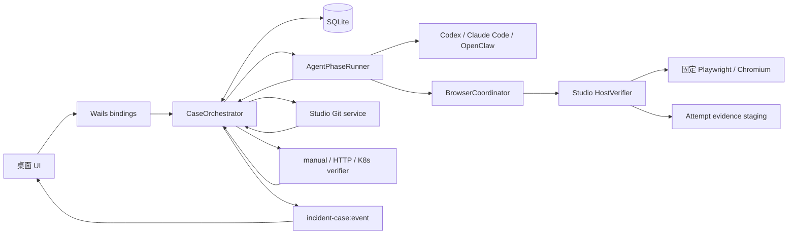
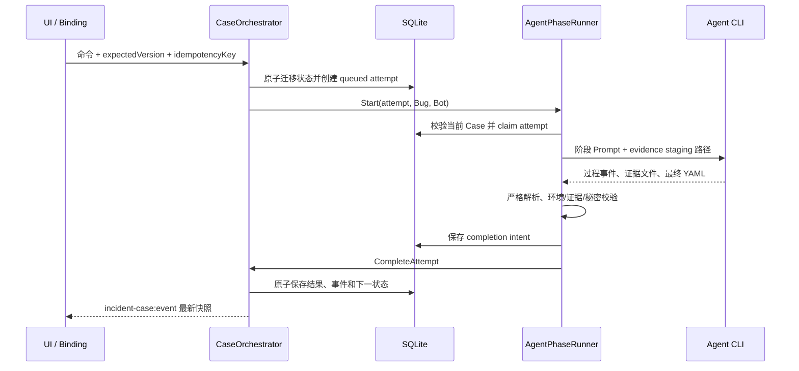
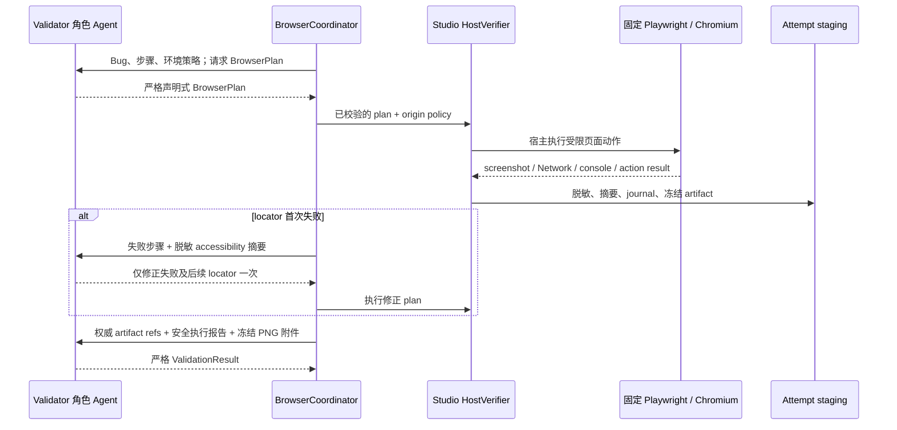
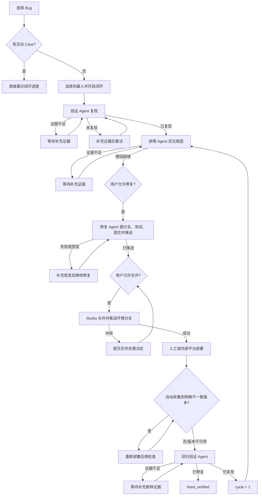

# 故障闭环与 Agent 工作流

本文说明 Troubleshooter Studio 当前持久化故障闭环的产品入口、数据模型、状态流转、各 Agent 的输入输出、人为授权点，以及 Git、部署验证和异常恢复边界。

最后更新：2026-07-16。

> 本文描述的是 Studio 如何编排一个完整 Case。排障 Agent 在“排障”阶段内部采用的七步取证法，见[排障链路](troubleshooting-flow.md#7-步主线)。

## 1. 核心原则

- 一个 Bug 同一时间最多关联一个未结束的活动 Case。
- Bug 是外部工单输入，Case 才是故障闭环的持久化状态。
- SQLite 是 Case、attempt、证据、授权和事件的真源；`CaseOrchestrator` 是唯一状态写入口。
- Agent 一次只执行一个阶段并返回结构化结果，不能通过自由文本自行跨阶段。
- 验证、排障、修复和回归由 Agent 执行；合并由 Studio Git service 执行；应用部署由人或外部平台执行。
- 修复和合并分别需要一次独立用户授权；“已部署”还必须经过只读版本验证，不能只相信按钮或文本通知。
- Web validation / regression 的浏览器由 Studio 宿主持有；validator 只规划受限动作并判断宿主证据，不在 Agent CLI 沙箱中启动 Chromium。
- 所有外部副作用都以幂等、可恢复和可审计为前提，不能把未知结果当作成功。

## 2. 产品入口与活动 Case

故障闭环的主入口是桌面端 `/incidents` 页面。

用户点击 Bug 收件箱中的工单后：

1. Studio 选择该 Bug。
2. 如果该 Bug 已有活动 Case，页面直接展示其闭环进度，不再要求点击“进入故障闭环”。
3. 如果没有活动 Case，页面显示机器人选择和“开启故障闭环”。
4. “重新开始故障闭环”会归档旧 Case，并创建一个从验证阶段开始的新 Case。

主界面只展示活动 Case。以下状态视为已结束，不再作为该 Bug 的活动 Case：

- `fixed_verified`：修复已通过回归验证。
- `legacy_archived`：旧 `runs.json` 导入的只读记录。
- `reset_archived`：被“重新开始”取代的旧 Case。

这些记录当前仍保留在 SQLite 中用于审计；主界面隐藏它们，但当前实现没有自动清理历史 Case 的定时任务。

闭环卡片以 Bug 标题、轮次、环境和当前状态作为用户信息。`case-reset-case-cycle-...` 之类的内部 Case ID 只用于持久化、幂等和排查，不应作为主标题。

## 3. 总体架构



各层职责：

| 层 | 职责 | 不负责 |
|---|---|---|
| UI / Wails binding | 选择 Bug 和机器人、提交动作、展示进度 | 直接修改 Case 状态 |
| `CaseOrchestrator` | 校验命令、执行状态迁移、持久化审计、调度阶段 | 自己分析 Bug 或修改业务代码 |
| `AgentPhaseRunner` | 为单个 attempt 生成阶段 Prompt、启动 CLI、解析结构化输出 | 自行决定跨到下一阶段 |
| Agent CLI adapter | 在选定工作区运行 Codex、Claude Code 或 OpenClaw | 写闭环数据库 |
| Browser coordinator / HostVerifier | 编排 BrowserPlan、执行宿主 Chromium、脱敏并冻结浏览器证据 | 接收任意脚本、替 Agent 判断业务结论 |
| Git service | 在隔离 worktree 中合并并推送环境分支 | 部署应用 |
| Deployment verifier | 只读确认目标环境包含预期 commit | 相信未经验证的“已部署”声明 |
| SQLite store | 保存快照、attempt、证据、授权、副作用检查点和事件 | 编排业务流程 |

用户选择的基础机器人决定 Agent target。`validation` 和 `regression` 必须通过同一 phase resolver 切换到该安装的 validator 角色和工作区；`investigation` 和 `fix` 保持所选基础机器人。旧安装缺少 validator 时 attempt 以 `validator_not_installed` 失败并提示重新部署，不能静默退回排障工作区伪装验证。

### 3.1 Agent 单次执行协议

四类 Agent 共享同一套持久化执行协议，阶段差异只体现在 Prompt、允许的行为和结果 schema。



具体执行顺序：

1. 编排器先在事务中迁移 Case、创建 `queued` attempt，再调度 Agent；不会先启动进程再补状态。
2. Runner 启动前复核 attempt 仍是当前 Case、当前 cycle、当前 phase 和当前机器人，并用原子 claim 防止多进程重复启动。
3. Runner 为 attempt 创建 Studio 管理的 evidence staging，并把阶段 Prompt、Bug、机器人工作区和结构化输入交给 CLI adapter。
4. Agent 运行时可以持续产生阶段事件，最终必须提交符合当前阶段 schema 的 YAML；证据文件必须写入指定 staging。
5. Runner 严格校验结果格式、Case 环境、artifact 路径和内容、回归证据新鲜度、修复 checkpoint，以及输出是否含敏感信息。
6. Runner 在调用完成回调前先持久化 completion intent；即使进程在此后退出，Studio 重启也能精确重放同一完成命令。
7. `CaseOrchestrator.CompleteAttempt` 再次验证 attempt 归属和结果门槛，在一个事务中保存结果、证据索引、代码变更、时间线和下一状态。

只读阶段的 Agent 进程异常时最多受控重试一次；修复阶段因为可能已经产生 commit 或 push，绝不盲目重跑。无效 YAML、环境不匹配或证据登记失败不会推进为成功：验证、排障和回归回到等待证据，修复进入 `fix_failed`。

### 3.2 Web validation / regression 的宿主浏览器协议

有 `frontend_url`，或最新补充明确要求 Web / 页面 / 浏览器复现时，validation / regression 在同一个 `PhaseAttempt` 内由 `BrowserCoordinator` 执行三段式协议：



简写为：

```text
validator 规划 BrowserPlan
  → Studio 宿主执行并脱敏取证
  → 最多一次 locator 修正
  → validator 基于截图/Network/console 给出 ValidationResult
```

BrowserPlan 只允许 `goto`、`click`、`fill`、`press`、`select`、`wait_for` 和 `screenshot`，禁止任意 JavaScript、XPath、文件上传、Cookie、Authorization 和凭据输入。HostVerifier 按正式配置校验 origin、DNS/IP 和生产限制；`is_prod=true` 只允许导航、等待和截图。宿主 artifact 在最终 evaluator 调用前冻结，evaluator 只能解释证据，不能改写路径。最终 PNG 不是只以路径写进 prompt：Codex 通过 `--image` 接收，Claude Code 通过只读目录和 Read 能力接收，OpenClaw 通过工作区内的短期只读 PNG 触发原生 prompt image load；调用结束即清除临时视图。临时绝对路径不得写入 `ValidationResult` 或 Case。Web 结论要推进为 `reproduced`、`not_reproduced`、`fixed_verified` 或 `still_reproduces`，必须存在 HostVerifier 确认的最终 PNG 渲染截图。

检测到 auth origin、password 输入、关键 401/403 或已知登录 route 时，当前 attempt 以 `browser_login_required` 进入 `waiting_evidence`，且不截登录表单。用户点击“打开验证浏览器完成登录”，在 Studio 打开的可见浏览器中自行完成 SSO/MFA；Studio 加密保存 `storageState` 后创建同 Case / cycle、父链明确的新 attempt。账号、密码、Cookie 和 storageState 不进入 Case 输入或 artifact。

## 4. 端到端主流程



主成功状态路径是：

```text
pending_validation -> validating -> reproduced -> investigating
-> root_cause_ready -> waiting_fix_approval -> fixing -> fix_pushed
-> waiting_merge_approval -> merging -> waiting_deployment
-> deployment_verified -> regression_validating -> fixed_verified
```

`reproduced`、`root_cause_ready`、`fix_pushed`、`deployment_verified` 和 `still_reproduces` 多为编排器内部的短暂状态，满足条件后会自动创建下一阶段 attempt 或进入下一等待门。

## 5. 各 Agent 工作流程

| 逻辑角色 | 启动条件 | 允许做的事 | 结构化结果决定 |
|---|---|---|---|
| 验证 Agent | Case 开启或用户补证重试 | 复现、采集证据 | 是否进入排障 |
| 排障 Agent | 已复现，或上一轮回归仍复现 | 只读取证和根因分析 | 是否开放修复授权 |
| 修复 Agent | 用户批准根因对应的修复 | 改代码、测试、提交、推修复分支 | 是否开放合并授权 |
| 回归验证 Agent | 外部部署已确认；运行版本若可自动采集则作为附加证据 | 按原场景重新验证并采集新证据 | 关闭 Case 或进入下一 cycle |

### 5.1 验证 Agent：首次复现

阶段标识：`validation`；attempt mode：`reproduce`。

目标是回答“这个 Bug 在指定环境是否可以复现”，不做根因分析，也不修改源码。

输入包括：

- Bug 标题、描述、来源、系统和环境。
- 前端地址、接口线索和工单附件。
- 本次及父 attempt 链上的用户补充信息。
- 上一次结构化验证结果。

执行规则：

1. 优先执行用户最新的明确指令；例如用户要求通过 Web 验证时，不能只重复读取旧截图。
2. Web attempt 先由 validator 输出 BrowserPlan，Studio HostVerifier 在宿主执行；validator 不得直接启动 Playwright、Chromium 或工作区兼容采集脚本。
3. locator 失败只允许在同 attempt 内修正失败步骤及后续步骤一次；第二次失败保留失败现场截图并进入 `waiting_evidence`。
4. `browser_login_required` 由 Studio 可见浏览器处理，不向 Case 索要账号、密码或 Cookie；运行时损坏、validator 缺失和策略拒绝属于系统错误，不能伪装成业务 `gaps`。
5. 最终 evaluator 必须实际读取 Studio 作为附件交付的冻结渲染截图，并结合脱敏 Network / console / action trace 输出 `ValidationResult`；不能发明或修改 artifact 引用，也不能把临时附件路径写入结果。
6. `reproduced` 必须同时提供实际表现、预期表现，以及至少一份属于当前 attempt 的已登记证据；Web 成功结论还必须有最终渲染截图。
7. 非 Web 场景继续使用附件、HAR、API、`curl`、trace 或日志证据，不强制启动浏览器。

结构化输出核心字段：

| 字段 | 含义 |
|---|---|
| `verification_status` | `reproduced`、`not_reproduced` 或 `insufficient_info` |
| `environment` | 实际验证环境 |
| `observed_behavior` | 实际观察到的表现 |
| `expected_behavior` | 预期表现 |
| `scenario_hash` | 可供回归绑定的场景摘要 |
| `evidence[]` | 本次验证证据 |
| `gaps[]` | 尚缺信息 |

结果流转：

- `reproduced`：自动进入排障。
- `not_reproduced`：停在未复现，补充信息后重试。
- `insufficient_info`：进入等待证据。

### 5.2 排障 Agent：根因定位

阶段标识：`investigation`。

目标是在只读前提下给出证据支持的根因，不修改代码。它应先读取生成机器人中的 `incident-investigator/SKILL.md`，内部执行[七步排障主线](troubleshooting-flow.md#7-步主线)：收前提、对齐时间轴、横向判断、追下游、多向取证、形成结论、沉淀。

输入包括：

- 已验证的复现场景、实际表现和预期表现。
- 首次验证证据引用。
- 当前 cycle、目标环境和用户补充。
- 上一轮仍复现时的部署版本、回归证据和差分信息。

结构化输出核心字段：

| 字段 | 含义 |
|---|---|
| `investigation_status` | `root_cause_ready` 或 `insufficient_info` |
| `root_cause` | 唯一、可操作的根因结论 |
| `confidence` | `high`、`medium` 或 `low` |
| `evidence[]` | 支撑结论的证据 |
| `gaps[]` | 无法闭合的证据缺口 |

只有根因明确、置信度为 `high` 且没有阻断修复的关键缺口，才进入“等待允许修复”；否则回到等待证据。

### 5.3 修复 Agent：最小修复并推送

阶段标识：`fix`。

修复只能在用户完成第一次授权后启动。授权精确绑定根因 attempt 和当时的 Case version，避免根因变化后沿用旧授权。

修复 Agent 的工作流程：

1. 从环境分支创建独立修复分支。
2. 围绕已批准根因做最小改动。
3. 运行与风险相称的测试。
4. 提交修改。
5. 推送修复分支，不直接修改环境分支。
6. 返回每个仓库的 base branch、fix branch、commit、remote 和测试结果。

结构化输出核心字段：

| 字段 | 含义 |
|---|---|
| `fix_status` | `fixed_pushed`、`blocked` 或 `failed` |
| `branches` | 仓库、基线、修复分支、commit、remote、目标分支 |
| `changes[]` | 实际代码改动摘要 |
| `tests[]` | 执行过的测试及结果 |
| `risks[]` | 剩余风险 |
| `blocked_reason` | 受阻原因 |
| `evidence[]` | 修复与测试证据 |

修复有 Git 副作用，因此不盲目重跑：

- 首次 push 前写入 `prepared` checkpoint。
- 全部 push 后写入 `pushed` checkpoint。
- Studio 以远端精确 ref 是否指向声明 commit 为成功真源。
- 临时网络或 SSH 不可用时保留 attempt 和 checkpoint 做有界恢复，不重新执行 Agent。
- 远端可读但 ref 缺失或漂移时进入 `fix_failed`。

### 5.4 回归验证 Agent：验证已部署修复

阶段标识：`regression`；attempt mode：`regression`。

它复用验证 Agent 的逻辑角色，但输入被固定到原始复现场景、目标环境和本次部署观察。运行版本能自动采集时一并绑定；采集不到时版本为空，不能要求用户手工填写：

- 原始 validation attempt、实际表现、预期表现和 `scenario_hash`。
- 原始证据引用，但不能将其作为本次回归结果。
- 本轮 cycle、预期 merge commit、部署观察和目标环境。
- 用户为本次回归补充的信息。

回归结论必须使用当前 attempt 启动后采集的新鲜证据：

- 环境和已验证部署必须一致。
- request ID 或 trace ID 不能沿用历史值。
- 文件 SHA256 不能复用首次验证证据冒充新结果。

Web 回归使用与首次验证完全相同的 validator → HostVerifier → evaluator 协议和一次 locator 修正上限，并绑定本次部署观察。原始截图只作对照；`fixed_verified` / `still_reproduces` 必须引用本次 regression attempt 的新最终渲染截图和宿主冻结的当前证据。没有自动采集到部署版本时，新鲜度仍由 attempt 启动时间、目标环境、请求/trace 标识和证据摘要保证。

结果流转：

- `fixed_verified`：闭环完成，Case 终止。
- `still_reproduces`：保存本轮部署版本和新证据，`cycle_number + 1`，自动创建新的排障 attempt；仍使用同一个 Case。
- `insufficient_info`：回到等待证据，补证后继续当前回归绑定。

### 5.5 Agent 与阶段之间的上下文传递

闭环不依赖 Agent 自己记住上一次对话，跨阶段上下文都由 Studio 结构化保存并重新组装：

| 来源 | 传给下一阶段的内容 |
|---|---|
| 验证 → 排障 | 环境、复现场景、实际/预期表现、`scenario_hash`、当前证据引用 |
| 排障 → 修复 | 高置信根因、根因 attempt ID、证据和用户修复授权范围 |
| 修复 → 合并 | 每个仓库的修复分支、精确 commit、目标环境分支和测试结果 |
| 合并 → 部署验证 | merge approval scope、每个仓库的 merge commit 和目标分支 |
| 部署确认 → 回归 | 原始复现场景、预期 commit、部署观察、目标环境，以及可选的自动采集版本 |
| 回归仍复现 → 下一轮排障 | 新鲜回归证据、部署版本、实际表现和递增后的 cycle |

同一阶段补证时，新 attempt 通过 `ParentAttemptID` 指向上一次 attempt。验证阶段会沿父链汇总所有用户补充，按时间排序，并明确以最新指令为最高优先级；回归补证则继续绑定原始场景和本轮已验证部署，不能换成另一个未经授权的验证目标。

## 6. 非 Agent 阶段

### 6.1 合并：Studio Git service

修复分支推送成功后，需要第二次、独立的用户授权。合并授权绑定：

- 每个仓库的精确修复 commit。
- 目标环境分支。
- 授权时的目标分支 HEAD。

Studio 在隔离 worktree 中合并并推送环境分支。目标 HEAD 已变化时旧授权失效，必须重新检查和授权；发生冲突时进入 `merge_conflict`，不会把半成品写入用户工作区或伪装成成功。远端结果不确定时先核对远端状态，再决定是否重试尚未完成的 push。

### 6.2 部署：人工或外部平台

Studio 不执行应用部署。环境分支推送后进入 `waiting_deployment`，由人或发布平台完成部署。

“已部署，开始验证”是一条人工部署确认和可选的运行版本采集命令。用户不填写版本号或 commit；Studio 按配置自动尝试采集：

- 全部匹配：记录精确版本证据并进入回归验证。
- 未配置采集方式、运行时未暴露版本、端点暂不可读或只能识别部分仓库：记录 `unavailable` 诊断，版本留空并进入回归验证。
- 只有版本接口或显式 K8s revision 字段明确显示与期望 commit 不一致时，才进入 `deployment_unverified`；重新部署后再检查。

K8s 采集复用 `observability.k8s_runtime.service_map` 中已有的环境、服务、集群、Namespace 和 Deployment 映射；创建机器人向导不再提供单独的版本确认配置。环境未显式配置 `deployment_verification` 且启用了 K8s 运行时可观测性时自动取证，取不到版本也不阻塞回归。旧 YAML 的 HTTP/K8s/manual 配置继续兼容。

HTTP verifier 默认禁用系统代理，并拒绝 loopback、RFC1918/ULA、link-local、multicast、unspecified 和云 metadata。精确环境 URL 可用 `allow_private: true` 显式开放内网，但 metadata 地址始终禁止。

## 7. 状态、页面动作与下一步

| 状态 | 页面含义 | 主动作或自动行为 |
|---|---|---|
| `pending_validation` | 等待首次验证 | 开始验证 |
| `validating` | 验证 Agent 运行中 | 停止当前验证 |
| `waiting_evidence` | 当前阶段证据不足 | 补充证据并继续到原阶段 |
| `reproduced` | 已复现 | 自动进入排障 |
| `not_reproduced` | 当前条件下未复现 | 补充证据并重试 |
| `investigating` | 排障 Agent 运行中 | 停止当前排障 |
| `root_cause_ready` | 根因结构化结果已就绪 | 自动进入等待修复授权 |
| `waiting_fix_approval` | 等待第一次用户授权 | 允许修复 |
| `fixing` | 修复 Agent 运行中 | 停止当前修复 |
| `fix_failed` | 修复失败或受阻 | 补充信息并继续修复 |
| `fix_pushed` | 修复分支已远端确认 | 自动进入等待合并授权 |
| `waiting_merge_approval` | 等待第二次用户授权 | 允许合并环境分支 |
| `merging` | Studio 正在合并/推送 | 等待完成 |
| `merge_conflict` | 合并冲突或需要决定 | 提交合并处理决定 |
| `waiting_deployment` | 等待外部部署 | 已部署，开始验证 |
| `deployment_unverified` | 明确检测到运行版本与期望 commit 不一致 | 重新部署后再检查 |
| `deployment_verified` | 部署门已确认；版本证据可能已采集，也可能为空 | 自动启动回归 |
| `regression_validating` | 回归 Agent 运行中 | 停止回归验证 |
| `still_reproduces` | 修复后仍可复现 | cycle 加一并自动回到排障 |
| `fixed_verified` | 回归确认已修复 | 终态 |
| `legacy_archived` | 历史只读记录 | 可从新一轮验证继续 |
| `reset_archived` | 已被新 Case 取代 | 终态，只读审计 |

此外，所有非终态都允许用户明确重置到 `reset_archived`。恢复过程还可能让 `merging` 回到 `waiting_merge_approval` 重新确认；旧 Case 缺少合法回归基线时，`deployment_verified` 会 fail closed 到 `waiting_evidence`，不会强行启动回归。精确合法边以 `workflow_transition.go` 为准。

### 7.1 页面动作到编排器命令

| 页面动作 | 桌面 binding | 编排器命令/方法 | 主要结果 |
|---|---|---|---|
| 开启故障闭环 / 开始验证 | `StartIncidentCase` | `CreateAndStartCase` 或 `StartCase` | 创建 validation attempt 并进入 `validating` |
| 补充证据并继续 | `ContinueIncidentCase` | `ContinueWithEvidence` | Agent 阶段创建父链 attempt；合并/部署补充返回对应 gate |
| 打开验证浏览器完成登录 | `OpenIncidentBrowserLogin` | 持久化 browser recovery operation 后继续原阶段 | 可见浏览器手动登录并创建父链 continuation attempt |
| 清除此环境登录态 | `ClearIncidentBrowserSession` | HostVerifier session clear | 清除当前 system / environment / application origin 的 session |
| 修复浏览器环境并重试 | `RepairIncidentBrowserRuntime` | 固定 runtime repair + probe 后继续原阶段 | 仅在 `browser_runtime_broken` 下创建 continuation attempt |
| 允许修复 | `ApproveIncidentFix` | `ApproveFix` | 保存第一次授权并启动 fix attempt |
| 允许合并环境分支 | `ApproveIncidentMerge` | `ApproveMerge` | 保存第二次授权并由 Git service 合并 |
| 已部署，开始验证 | `NotifyIncidentDeployed` | `NotifyDeployed` | 保存部署 reservation，运行只读 verifier |
| 停止当前阶段 | `CancelIncidentAttempt` | `CancelAttempt` | 取消当前 attempt 并进入对应等待/失败状态 |
| 重新开始故障闭环 | `ResetIncidentCaseWithWarnings` | `ResetCaseWithOutcome` | 归档旧 Case、创建接替 Case并处理旧 Agent 取消 |
| 手动刷新 | `ListIncidentCases` + `GetIncidentCase` | 只读 store 查询 | 重新获取快照，不触发任何阶段 |

所有写动作都由前端生成稳定幂等键，并携带页面看到的 Case version。版本冲突时页面应刷新最新快照，让用户基于新状态重新确认，不能静默覆盖。

## 8. 补证、停止与重新开始

### 补充证据

补证不会创建一个脱离上下文的新任务。编排器根据等待前的阶段，把新 attempt 接回 validation、investigation、fix 或 regression，并用 `ParentAttemptID` 保留连续上下文。

验证阶段会沿父 attempt 链汇总用户补充，并明确让最新指令优先。阶段输出在页面上以“环境、预期表现、实际观察、仍需补充、证据”等可读区块展示，不直接把 JSON 作为主内容。

### 停止当前阶段

停止只针对当前 Case 的当前 attempt：

- validation、investigation、regression 被停止后进入 `waiting_evidence`。
- fix 被停止后进入 `fix_failed`。
- 已经脱离当前 Case 的旧 attempt 不会被误停。

停止命令先以幂等方式持久化，再调用 runner 的取消能力；底层取消结果未知时必须向用户暴露，不能假装已停止。

### 重新开始故障闭环

重新开始不会删除历史，也不会尝试回滚已经发生的 Git 或部署副作用。它在同一个 SQLite 事务中：

1. 将旧 Case 标记为 `reset_archived`。
2. 记录旧、新 Case 的双向替代关系。
3. 创建从 `pending_validation` 开始的新 Case。
4. 如果旧 attempt 仍在运行，写入持久化取消 outbox，再由唯一 claim 者调用 runner。

取消调用如果在进程崩溃窗口中结果未知，系统保持人工处置边界，不自动重复调用不具备幂等保证的 runner。

## 9. 持久化模型

| 对象 | 用途 |
|---|---|
| `Bug` | 从 Bug 平台同步的输入，不承载闭环状态 |
| `IncidentCase` | 一个持久化闭环，保存 Bug、环境、状态、cycle、当前 attempt、机器人和 version |
| `PhaseAttempt` | 一次 validation、investigation、fix 或 regression 阶段执行 |
| `EvidenceArtifact` | 证据元数据、摘要、attempt 归属和脱敏状态 |
| `CodeChange` | 修复分支、commit 和仓库变更 |
| `Approval` | 修复或合并的用户授权及其精确作用域 |
| `DeploymentObservation` | 目标环境的版本/commit 只读观测 |
| `TransitionEvent` | 追加式状态时间线和审计记录 |

所有写命令都携带 Case `expectedVersion` 和幂等键：

- `expectedVersion` 防止页面基于过期快照覆盖新状态。
- 幂等键保证重复点击、重放回调或重启恢复不会重复创建 attempt、授权、merge、push、部署观察或回归。
- phase run claim 防止同一个 queued attempt 被多个进程同时启动。
- completion intent 允许 Agent 完成回调跨重启精确重放。

## 10. 证据与安全边界

- 大证据文件保存在 Studio 管理的 artifact 目录，SQLite 只保存元数据和摘要。
- artifact 统一限制为 16 MiB，并防目录穿越、符号链接替换和读取过程中的文件变化。
- 捕获时计算 SHA256，并扫描 token、Cookie、Authorization、password 和 URL userinfo 等秘密。
- 浏览器不保存原始 Playwright trace；HostVerifier 只登记最终/步骤 PNG、脱敏 Network、console 和 `browser-actions.json`，Runner 仍执行第二道敏感信息扫描。
- 登录 `storageState` 使用 system / environment / application origin 绑定的 AES-GCM key；密钥进入系统 keyring，加密文件权限仅限当前用户。keyring 不可用时只保留内存 session，不落明文。
- 截图预览通过 Case ID + artifact ID 的安全 binding 重新校验归属、路径、大小和 PNG 类型；页面不把内部 `path_or_reference` 直接作为图片 URL。
- 证据严格绑定 Case、cycle 和 attempt；回归新鲜度由时间、环境、请求标识和摘要共同校验，自动采集到部署版本时再额外绑定版本。
- Agent 的自然语言输出不是状态真源，只有通过结构校验并持久化后的结果才能推进 Case。

## 11. 页面刷新与实时更新

Case 变化后，Studio 通过 `incident-case:event` 通知前端，页面自动重新读取活动 Case 和详情。阶段输出会在新增内容时自动滚动到底部；过程时间线默认只显示最新三条，用户可展开全部。

页面右上角的刷新按钮只用于重新读取 Bug、Case 和当前详情，处理偶发事件丢失或外部状态变化；它不会重新运行 Agent、推进状态或重新触发修复/合并。正常情况下无需依赖手动刷新。

## 12. 恢复与失败处理

- Studio 启动时执行 interrupted attempt 和未完成副作用的恢复检查。
- 只读 Agent 进程在明确没有副作用时可做一次受控重试；修复 Agent 不盲重试。
- 修复恢复先检查远端 fix ref，合并恢复先检查目标分支和远端 commit，部署恢复复用 reservation 和 verifier 快照。
- 多仓库只完成一部分时保持未完成状态，不能以部分成功推进。
- Case 状态和外部状态冲突时 fail closed，要求补证、重新授权或人工处置。

## 13. 代码索引

| 主题 | 主要文件 |
|---|---|
| Case 类型和持久化对象 | `internal/bughub/workflow_types.go` |
| 合法状态迁移 | `internal/bughub/workflow_transition.go` |
| 命令、授权、调度和结果编排 | `internal/bughub/workflow_orchestrator.go` |
| 阶段 Prompt 和结构化结果解析 | `internal/bughub/workflow_phase_runner.go` |
| phase validator 角色与 BrowserCoordinator | `internal/bughub/workflow_phase_bot.go`、`internal/bughub/workflow_browser_coordinator.go` |
| 宿主 runtime、HostVerifier、session 和 worker | `internal/browserverify/` |
| Codex/Claude Code/OpenClaw CLI 执行 | `internal/bughub/codex_runner.go` |
| Git 合并和统一恢复 | `internal/bughub/workflow_git.go`、`internal/bughub/workflow_recovery.go` |
| 部署验证和回归输入 | `internal/bughub/workflow_deployment.go`、`internal/bughub/workflow_regression.go` |
| SQLite schema/store | `internal/bughub/workflow_store.go`、`internal/bughub/workflow_store_schema.go` |
| 桌面 binding | `cmd/tshoot-desktop/bindings_bug_workflow.go`、`cmd/tshoot-desktop/bindings_bug_browser.go` |
| 页面入口和 Bug/Case 自动切换 | `web/src/pages/IncidentWorkbenchPage.vue` |
| Case 详情、按钮和阶段输出 | `web/src/components/BugCaseLifecycle.vue`、`web/src/components/BugCaseArtifacts.vue` |
| 前端命令和实时事件 | `web/src/lib/useIncidentCase.ts` |

修改闭环时还应同步：

1. 状态增删或语义变化：更新 transition table 和非法跳转测试。
2. 新按钮、Agent 回调或副作用：补重复请求幂等测试。
3. 跨事务或进程边界：补 SQLite reopen/crash recovery 测试。
4. Git 行为：只用临时本地仓库和 bare remote 测试。
5. 部署行为：只用 fake verifier、`httptest` 或 fake K8s reader，Studio 不执行真实部署。
6. 涉及架构边界的变化：在 `docs/decisions.md` 追加 ADR，不修改旧条目。
